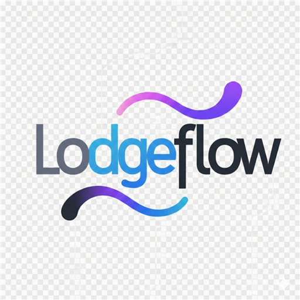
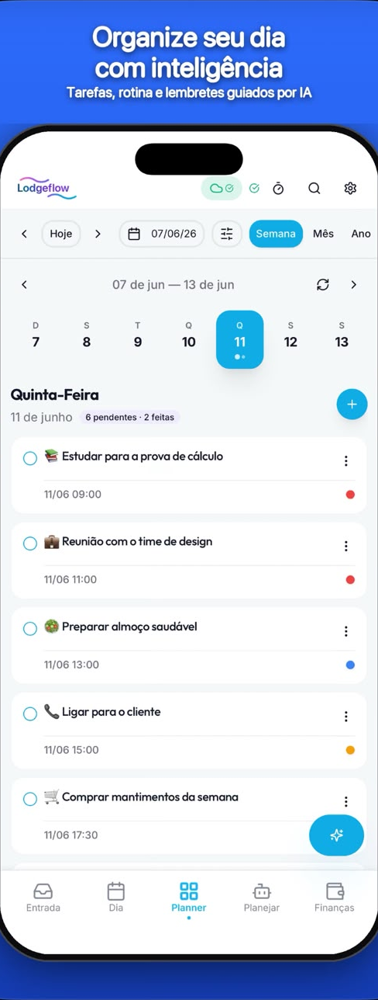
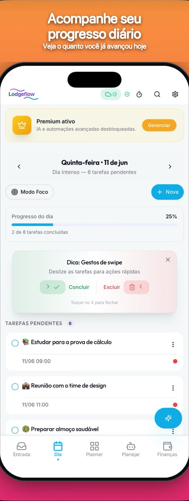
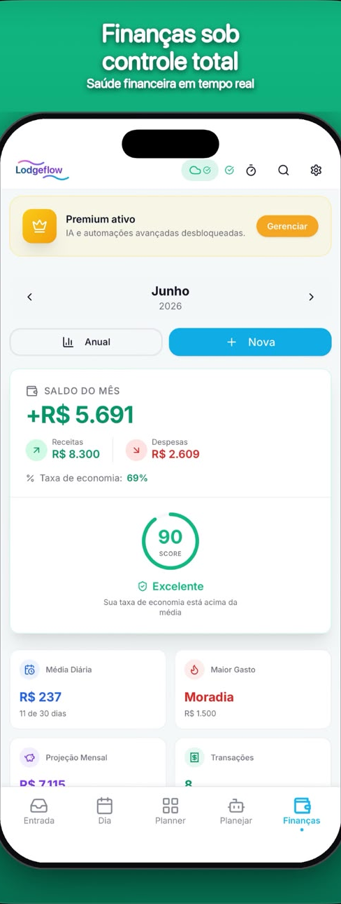
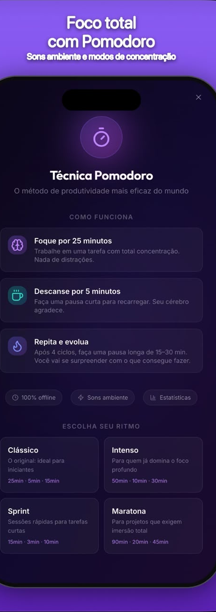
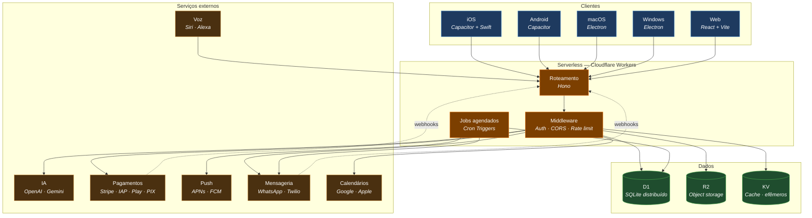
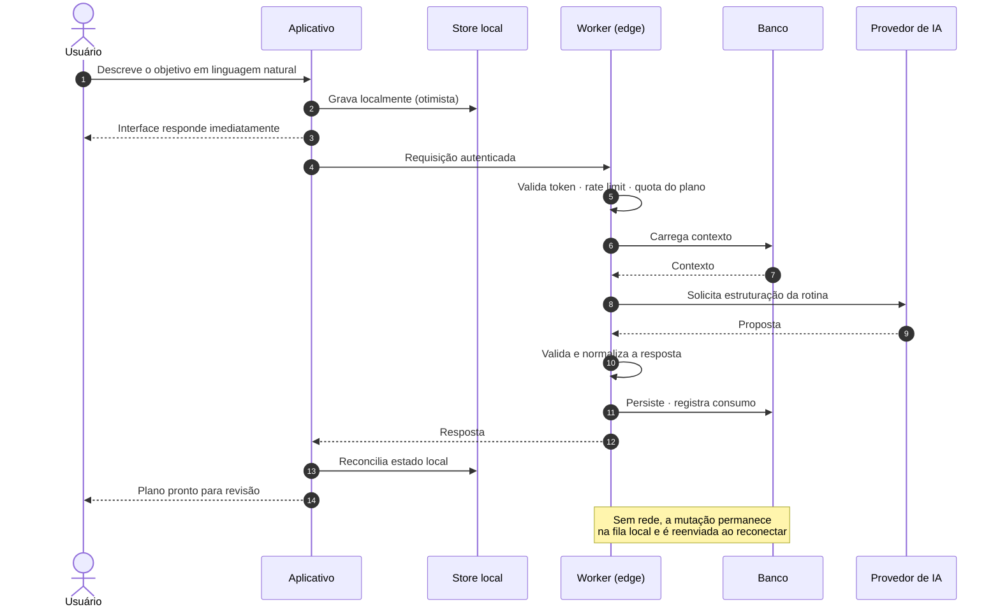

# LodgeFlow

**Plataforma de produtividade com IA — iOS, Android, macOS, Windows e Web**

 

[**Baixar na App Store**](https://apps.apple.com/br/app/lodgeflow/id6760812034) ·
[**Baixar no Google Play**](https://play.google.com/store/apps/details?id=com.lodgeflow.app)

---

**Este repositório contém documentação técnica, não o código-fonte.**

O LodgeFlow é um produto comercial em produção e seu código é proprietário. O que está publicado
aqui é a arquitetura, as decisões de engenharia e os trade-offs por trás dele — sem endpoints reais,
credenciais, prompts de IA, esquema de banco de produção ou regras de negócio. Os exemplos de API e
payloads são fictícios e estão marcados como tal.

Se você tem pouco tempo, leia o **[SYSTEM_DESIGN.md](SYSTEM_DESIGN.md)** — é onde está o raciocínio.

English summary

 

LodgeFlow is a cross-platform AI productivity app (iOS, Android, macOS, Windows, Web) built on a
serverless edge architecture. This repository is documentation only: it covers the system design,
architecture decisions and engineering trade-offs behind the product, without exposing proprietary
source code, business logic, credentials or internal prompts. All API examples are fictitious.
Start with [`SYSTEM_DESIGN.md`](SYSTEM_DESIGN.md).

---

## Sumário

- [O produto](#o-produto)
- [Screenshots](#screenshots)
- [Funcionalidades](#funcionalidades)
- [Arquitetura](#arquitetura)
- [Tecnologias](#tecnologias)
- [Decisões técnicas](#decisões-técnicas)
- [Fluxo de uma operação](#fluxo-de-uma-operação)
- [Segurança](#segurança)
- [Distribuição](#distribuição)
- [Documentação](#documentação)

---

## O produto

LodgeFlow combina planejamento de rotina, gestão financeira e assistência por IA em um aplicativo
disponível de forma nativa em cinco plataformas.

A premissa é que a maior parte das ferramentas de produtividade ajuda a registrar intenções, mas não
a executá-las. O LodgeFlow ocupa o espaço entre as duas coisas: transforma uma descrição em linguagem
natural em um plano concreto, entrega esse plano nos canais que a pessoa já usa — calendário,
WhatsApp, Siri, Alexa, tela de bloqueio — e reorganiza o dia quando ele sai do trilho.

Do ponto de vista de engenharia, o problema interessante não é a interface. É sustentar uma
experiência coerente, offline-first e em tempo real através de cinco clientes distintos, com um
backend serverless na edge, integrações com uma dúzia de provedores externos e um modelo de dados que
precisa convergir mesmo quando o dispositivo passou horas sem rede.

---

## Screenshots

<table>
<tr>
<td align="center" width="33%"> <b>Planner semanal</b></td>
<td align="center" width="33%"> <b>Execução do dia</b></td>
<td align="center" width="33%"> <b>Planejamento com IA</b></td>
</tr>
<tr>
<td align="center"> <b>Finanças</b></td>
<td align="center"> <b>Modo foco</b></td>
<td align="center" valign="middle">Capturas da listagem pública na App Store</td>
</tr>
</table>

---

## Funcionalidades

**Planejamento**

Planejamento por IA a partir de linguagem natural · planner semanal com arrastar e soltar ·
calendário em visão de dia, mês e ano · tarefas, subtarefas e projetos · prioridades e recorrência ·
comentários e anexos por tarefa · filtros e busca · remarcação inteligente quando o dia atrasa ·
Pomodoro com estatísticas e sons ambiente · onboarding guiado · atalhos de teclado no desktop.

**Finanças**

Entradas, saídas, categorias e pendências · análise do panorama por IA · gráficos de evolução mensal
e resumo anual · score de saúde financeira · insights automáticos do período.

**Assistente de IA**

Interface conversacional para criar e ajustar o plano · transcrição de voz para tarefas · fluxo de
consentimento explícito em conformidade com a LGPD · histórico de consumo visível ao usuário.

**Notificações**

Lembretes com preferências por usuário · push nativo via APNs e FCM · notificações locais que
funcionam sem rede · chamadas VoIP para lembretes críticos, em tela cheia, atravessando o modo
silencioso · Live Activities na Dynamic Island e tela de bloqueio · widgets na home screen.

**Integrações**

Siri e App Intents · Alexa Skill própria com account linking · WhatsApp · Google Calendar e Apple
Calendar com sincronização bidirecional · login com Google e Apple.

**Plataforma**

Sincronização entre dispositivos · operação offline completa com reconciliação posterior ·
aplicativos nativos para iOS, Android, macOS e Windows, além da web · temas claro e escuro ·
assinaturas via Stripe, Apple IAP, Google Play e PIX · programa de indicação · exportação e exclusão
de dados pelo próprio app.

---

## Arquitetura

Arquitetura serverless na edge: não há servidores de aplicação persistentes. O backend roda como
funções distribuídas globalmente, com banco de dados e armazenamento de objetos no mesmo plano de
execução.

Quatro princípios sustentam esse desenho:

**Uma base de código, cinco plataformas.** O núcleo React é compartilhado. O que é genuinamente
nativo — CallKit, WidgetKit, EventKit, StoreKit — entra por plugins de ponte, não por reescrita.

**A edge é o servidor.** Sem VMs, sem containers, sem cold start relevante. A latência é dominada
pela distância física até o usuário, que a rede da Cloudflare já minimiza.

**O cliente é a fonte de verdade temporária.** Toda escrita é aplicada localmente primeiro e
reconciliada depois. A rede é tratada como opcional, não como pré-requisito.

**Integrações são isoladas.** Cada provedor externo fica atrás de uma fronteira própria, para que a
falha de um não derrube o produto.

Detalhamento em [docs/architecture.md](docs/architecture.md) e [SYSTEM_DESIGN.md](SYSTEM_DESIGN.md).

---

## Tecnologias

<table>
<tr><td valign="top" width="50%">

**Frontend**

React 18 · TypeScript · Vite · SWC · Tailwind CSS · Radix UI · shadcn/ui · TanStack Query ·
React Router · React Hook Form · Zod · Recharts · dnd-kit · date-fns

</td><td valign="top" width="50%">

**Backend**

Cloudflare Workers · Hono · TypeScript · Wrangler · Cron Triggers · jose (JWT) · bcrypt

</td></tr>
<tr><td valign="top">

**Dados**

Cloudflare D1 (SQLite distribuído) · R2 (object storage) · KV (cache) · migrations SQL versionadas

</td><td valign="top">

**Inteligência artificial**

OpenAI · Google Gemini · transcrição de voz · inferência local no dispositivo (Transformers.js)

</td></tr>
<tr><td valign="top">

**Mobile**

Capacitor 8 · Swift · CallKit · PushKit · WidgetKit · Live Activities · EventKit · App Intents ·
StoreKit · Google Play Billing

</td><td valign="top">

**Desktop**

Electron · electron-builder · empacotamento assinado para macOS e Windows

</td></tr>
<tr><td valign="top">

**Pagamentos e notificações**

Stripe · Apple IAP · Google Play Billing · PIX · APNs · Firebase Cloud Messaging

</td><td valign="top">

**Qualidade e operação**

TypeScript strict · ESLint · Vitest · logging estruturado · feature flags · alertas

</td></tr>
</table>

Racional de cada escolha, incluindo o que foi deliberadamente evitado, em
[docs/tech-stack.md](docs/tech-stack.md).

---

## Decisões técnicas

<b>Autenticação</b>

 

JWT com tokens de curta duração e renovação transparente. Suporta credenciais próprias (hash com
custo adaptativo) e OAuth 2.0 com Google e Apple pelos fluxos nativos de cada plataforma, não por
webview.

O token carrega identidade, não permissões. Um token com permissões congela o estado de autorização
no momento da emissão — revogar acesso exigiria esperar a expiração. Resolvendo a autorização a cada
requisição, uma mudança de plano ou bloqueio de conta tem efeito imediato.

Contas administrativas exigem 2FA. Tokens de terceiros são criptografados em repouso.

<b>Sincronização</b>

 

O estado é replicado entre todos os dispositivos do usuário. Cada mutação carrega metadados de versão
e origem, o que permite resolver conflitos de forma determinística quando dois dispositivos alteram o
mesmo registro sem terem se visto — ambos convergem para o mesmo resultado, em vez de o resultado
depender de quem chegou por último.

A sincronização com calendários externos é bidirecional e incremental: apenas o delta desde o último
ponto conhecido trafega.

<b>Offline-first</b>

 

A aplicação é funcional sem rede. Escritas são persistidas localmente e enfileiradas em fila durável
que sobrevive ao fechamento do app; a interface responde imediatamente e a fila é drenada quando a
conectividade retorna.

Foi assumido desde o primeiro dia porque não se retrofita: identificadores precisam ser gerados no
cliente, toda operação precisa ser idempotente, e a interface precisa representar três estados por
registro em vez de dois.

<b>Serverless na edge</b>

 

Cada requisição executa em um isolate efêmero próximo ao usuário. Isolates em vez de containers
significam ausência de cold start relevante — milissegundos, não segundos.

As restrições que isso impõe foram tratadas como disciplina de design: sem estado entre requisições,
tempo de execução limitado, sem processos em segundo plano. Operações longas são fatiadas em unidades
retomáveis, e todo job agendado é idempotente.

<b>Notificações</b>

 

Três canais escolhidos conforme criticidade e estado do dispositivo: push remoto (APNs, FCM), push
local agendado no aparelho e imune a falhas de rede, e push VoIP.

O VoIP é o mais distintivo: entrega o lembrete como uma chamada nativa em tela cheia, atravessando o
modo Não Perturbe. Uma notificação comum é silenciada e ignorada com facilidade; uma chamada não.

<b>Pagamentos</b>

 

Quatro provedores coexistem porque as lojas exigem o próprio sistema de cobrança: Stripe na web,
Apple IAP no iOS, Google Play Billing no Android e PIX no mercado brasileiro.

Todos convergem para um único estado interno de entitlement, resolvido no servidor. O aplicativo
pergunta o que o usuário pode fazer; ele nunca decide por conta própria. Recibos são validados no
servidor — um recibo validado apenas no cliente é trivialmente falsificável.

<b>Resiliência</b>

 

Com integrações a mais de dez provedores externos, algum estará indisponível em algum momento. Toda
chamada externa tem timeout; falhas transitórias usam retry com backoff; operações sensíveis e
webhooks são idempotentes; a falha de um recurso secundário não derruba o principal.

O produto continua funcional sem IA — planejar, registrar finanças, receber lembretes e sincronizar
não dependem de nenhum provedor de modelos estar no ar.

---

## Fluxo de uma operação

Duas propriedades importam nesse fluxo: a saída do modelo nunca é confiada sem validação estrutural,
e o usuário sempre revisa antes de o plano ser aplicado. A IA propõe; a pessoa decide.

Mais diagramas em [docs/diagrams/](docs/diagrams/).

---

## Segurança

| Camada | Prática |
|---|---|
| Autenticação | JWT de curta duração, renovação transparente, hash de senha com custo adaptativo |
| Autorização | Propriedade verificada por registro no servidor; nenhum acesso é inferido do cliente |
| OAuth 2.0 | Fluxos nativos com Google e Apple; `state` validado contra CSRF |
| 2FA | Segundo fator obrigatório em contas administrativas |
| Transporte | HTTPS/TLS em toda a superfície pública |
| Rate limiting | Limites por identidade e por rota, mais restritivos nas rotas caras |
| Criptografia | Tokens de terceiros e dados sensíveis criptografados em repouso |
| Validação | Todo payload validado por esquema antes de chegar ao domínio |
| Webhooks | Verificação de assinatura obrigatória; processamento idempotente |
| Segredos | Nunca versionados; injetados pelo gerenciador de segredos da plataforma |
| Privacidade | Consentimento explícito para IA, exportação e exclusão de conta (LGPD/GDPR) |

Detalhamento em [docs/security.md](docs/security.md).

---

## Distribuição

O aplicativo está publicado na [App Store](https://apps.apple.com/br/app/lodgeflow/id6760812034) e no
[Google Play](https://play.google.com/store/apps/details?id=com.lodgeflow.app), com versões desktop
assinadas para macOS e Windows, aplicação web em Cloudflare Pages e API em Cloudflare Workers.

A diferença de velocidade entre esses alvos molda o processo: backend e web sobem em minutos, mobile
depende de revisão das lojas. Como o usuário controla quando atualiza, sempre há aparelhos rodando
versões antigas contra o backend mais recente — o que torna compatibilidade retroativa uma
obrigação, não uma cortesia. Mudanças de contrato são aditivas por padrão, e remoções só acontecem
quando a telemetria confirma que nenhum cliente ativo depende do campo.

Detalhamento em [docs/deployment.md](docs/deployment.md).

---

## Documentação

| Documento | Conteúdo |
|---|---|
| **[SYSTEM_DESIGN.md](SYSTEM_DESIGN.md)** | Decisões arquiteturais, alternativas descartadas, trade-offs e escala |
| [docs/system-overview.md](docs/system-overview.md) | Visão geral do sistema e seus domínios |
| [docs/architecture.md](docs/architecture.md) | Arquitetura em camadas |
| [docs/tech-stack.md](docs/tech-stack.md) | Stack por categoria e o que foi evitado |
| [docs/backend.md](docs/backend.md) | Workers, Hono, D1, R2, JWT, jobs agendados |
| [docs/mobile.md](docs/mobile.md) | Capacitor, Swift, CallKit, WidgetKit, Siri |
| [docs/database.md](docs/database.md) | Modelo de dados conceitual e princípios de modelagem |
| [docs/ai.md](docs/ai.md) | Camada de IA, custo e conformidade |
| [docs/security.md](docs/security.md) | Modelo de segurança |
| [docs/deployment.md](docs/deployment.md) | Build, publicação e CI/CD |
| [api/openapi-example.yaml](api/openapi-example.yaml) | Contrato de API fictício, para demonstrar convenções |
| [examples/](examples/) | Payloads fictícios de request, response, webhook e JWT |
| [templates/](templates/) | Templates de configuração sem valores |

---

## Autor

Desenvolvido por **Diego Brantes**.

- LinkedIn — [in/diegobrantes](https://www.linkedin.com/in/diegobrantes/)
- App Store — [LodgeFlow](https://apps.apple.com/br/app/lodgeflow/id6760812034)
- Google Play — [LodgeFlow](https://play.google.com/store/apps/details?id=com.lodgeflow.app)

Dúvidas sobre as decisões de arquitetura descritas aqui são bem-vindas nas
[issues](https://github.com/DiegoBrantes/LodgeFlow/issues).

---

## Licença

A documentação deste repositório está sob licença [MIT](LICENSE).

O aplicativo LodgeFlow, seu código-fonte, marca e ativos visuais são proprietários e não estão
cobertos por essa licença.
