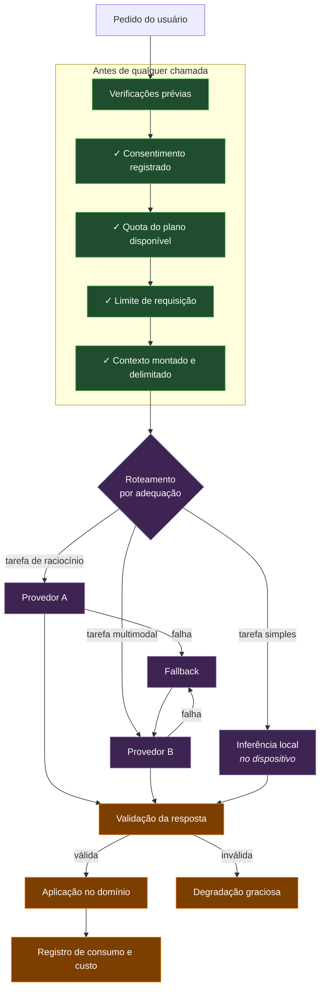
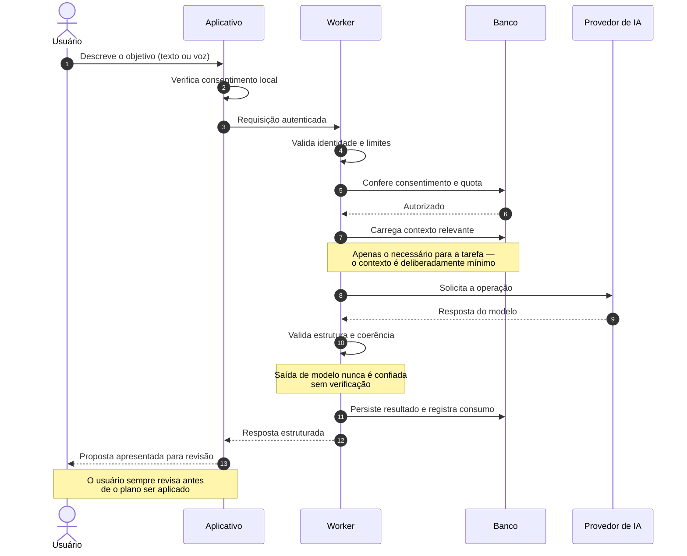

# Camada de Inteligência Artificial

> ⚠️ **Documento conceitual.** Nenhum prompt, instrução de sistema, esquema de saída, parâmetro de
> modelo, técnica proprietária de orquestração ou regra de negócio do LodgeFlow é revelado aqui.
>
> O que segue descreve a **arquitetura** da camada de IA e o **raciocínio** por trás dela.

---

## O papel da IA no produto

A IA não é um recurso adicional colado no produto — ela é o mecanismo que fecha a distância entre
*intenção* e *plano estruturado*.

Três necessidades distintas são atendidas:

| Necessidade | O que a IA faz |
|---|---|
| **Estruturação** | Converte uma descrição em linguagem natural em uma rotina organizada |
| **Reorganização** | Recompõe o dia quando o plano atrasa ou muda |
| **Análise** | Interpreta o panorama financeiro e destaca o que merece atenção |

Complementarmente, há **transcrição de voz** — ditado convertido em texto e depois em tarefas.

---

## Arquitetura multi-provedor

O sistema não depende de um único fornecedor de modelos.

### Provedores

**OpenAI** e **Google Gemini** são usados de forma complementar. A escolha entre eles considera a
natureza da tarefa, o custo por operação e a disponibilidade do momento — não há preferência fixa.

Há também **inferência local no dispositivo** (via Transformers.js) para tarefas que não exigem um
modelo grande. Isso tira carga do servidor inteiramente e mantém dados no aparelho quando possível.

### Por que múltiplos provedores

1. **Resiliência.** Provedores de IA têm indisponibilidades. Com um único fornecedor, a queda dele é
   a queda do recurso principal do produto.
2. **Adequação de custo.** Nem toda tarefa precisa do modelo mais capaz. Rotear por adequação reduz o
   custo por operação sem perda perceptível de qualidade.
3. **Capacidades diferentes.** Provedores têm forças distintas — multimodalidade, janela de contexto,
   latência. Usar cada um onde é melhor produz um resultado superior ao de qualquer um isolado.
4. **Independência.** Nenhuma mudança unilateral de preço ou política de um fornecedor consegue
   inviabilizar o produto.

---

## Fluxo de uma operação de IA

**Duas propriedades importantes desse fluxo:**

**A saída do modelo nunca é confiada cegamente.** Toda resposta passa por validação estrutural e de
coerência antes de tocar o domínio. Um modelo pode retornar algo malformado, incoerente ou fora do
escopo esperado — tratar isso como possibilidade normal, e não como exceção, é o que mantém o sistema
estável.

**O usuário sempre revisa.** A IA propõe; a pessoa decide. Nenhum plano é aplicado sem confirmação
explícita. Isso é uma decisão de produto tanto quanto de engenharia: mantém a pessoa no controle e
torna erros do modelo recuperáveis em vez de destrutivos.

---

## Prompt engineering — a abordagem, não os prompts

> Os prompts do LodgeFlow são propriedade intelectual e **não são divulgados**. O que segue descreve
> os princípios gerais aplicados.

| Princípio | Racional |
|---|---|
| **Contexto mínimo suficiente** | Enviar apenas o necessário reduz custo, latência e exposição de dados |
| **Saída estruturada** | Formato verificável programaticamente, não texto livre a ser interpretado |
| **Validação de esquema** | A resposta é conferida contra um contrato antes de ser usada |
| **Separação de instrução e dado** | Conteúdo do usuário nunca é interpretado como instrução ao modelo |
| **Determinismo onde importa** | Parâmetros ajustados por tarefa; nem tudo se beneficia de variação |
| **Avaliação contínua** | Mudanças de prompt são medidas contra casos reais antes de virarem padrão |

O quarto item merece destaque: manter a fronteira entre *instrução* e *dado do usuário* é a defesa
principal contra injeção de prompt. Conteúdo enviado pelo usuário é sempre tratado como dado a ser
processado, nunca como comando a ser obedecido.

---

## Controle de custo

Chamadas a modelos são, por unidade, a operação mais cara do sistema. O controle é ativo:

| Mecanismo | Como funciona |
|---|---|
| **Quota por plano** | Verificada **antes** da chamada, nunca depois |
| **Registro por operação** | Cada uso é contabilizado, com métricas de custo e performance |
| **Roteamento por adequação** | A tarefa determina o modelo, não o contrário |
| **Contexto delimitado** | Menos entrada significa menos custo e menos latência |
| **Inferência local** | Tarefas simples nunca chegam a sair do dispositivo |
| **Visibilidade administrativa** | Custo e performance observáveis, não descobertos na fatura |

Verificar a quota **antes** da chamada é o detalhe que mais importa. Verificar depois significa pagar
por uma operação que não deveria ter acontecido.

---

## Privacidade e conformidade — LGPD

O tratamento de dados pessoais por IA exige base legal explícita. A abordagem adotada:

### Consentimento explícito

Nenhum dado do usuário é enviado a um provedor de IA sem **opt-in registrado**. O consentimento é:

- **Explícito** — apresentado em um diálogo dedicado, com linguagem clara sobre o que acontece
- **Informado** — o usuário sabe quais dados são processados e para qual finalidade
- **Granular** — separado do aceite geral dos termos de uso
- **Revogável** — pode ser retirado a qualquer momento, nas configurações
- **Registrado** — a decisão é persistida e verificada a cada operação, no servidor

### Minimização de dados

Apenas o contexto estritamente necessário para a tarefa é enviado. Não há envio preventivo de
histórico completo "por precaução" — cada operação carrega o mínimo que a resolve.

### Direitos do titular

O produto implementa no próprio aplicativo:

- **Acesso e portabilidade** — exportação dos dados do usuário
- **Eliminação** — exclusão de conta com remoção dos dados associados
- **Transparência** — histórico de uso de IA visível ao usuário
- **Revogação** — retirada de consentimento a qualquer momento

### Registros

O logging da camada de IA é estruturado e **não inclui o conteúdo processado**. Registra-se a
ocorrência, o tipo de operação e o consumo — nunca o dado pessoal em si.

---

## Resiliência

| Situação | Comportamento |
|---|---|
| **Provedor indisponível** | Redirecionamento para provedor alternativo |
| **Resposta malformada** | Rejeitada na validação; nova tentativa ou degradação graciosa |
| **Tempo excedido** | Timeout por operação; nada espera indefinidamente |
| **Quota esgotada** | Mensagem clara ao usuário, com caminho de upgrade |
| **Falha total** | O produto continua funcional sem IA; o recurso degrada, o app não cai |

O último item é o mais importante: **o LodgeFlow funciona sem IA.** Planejar, registrar finanças,
receber lembretes e sincronizar não dependem de nenhum provedor de modelos estar no ar. A IA acelera
o uso; ela não é pré-requisito para ele.

---

## Ver também

- [security.md](security.md) — modelo de segurança e privacidade
- [backend.md](backend.md) — orquestração e fronteiras de integração
- [../SYSTEM_DESIGN.md](../SYSTEM_DESIGN.md) — custo de IA como dimensão de escala
