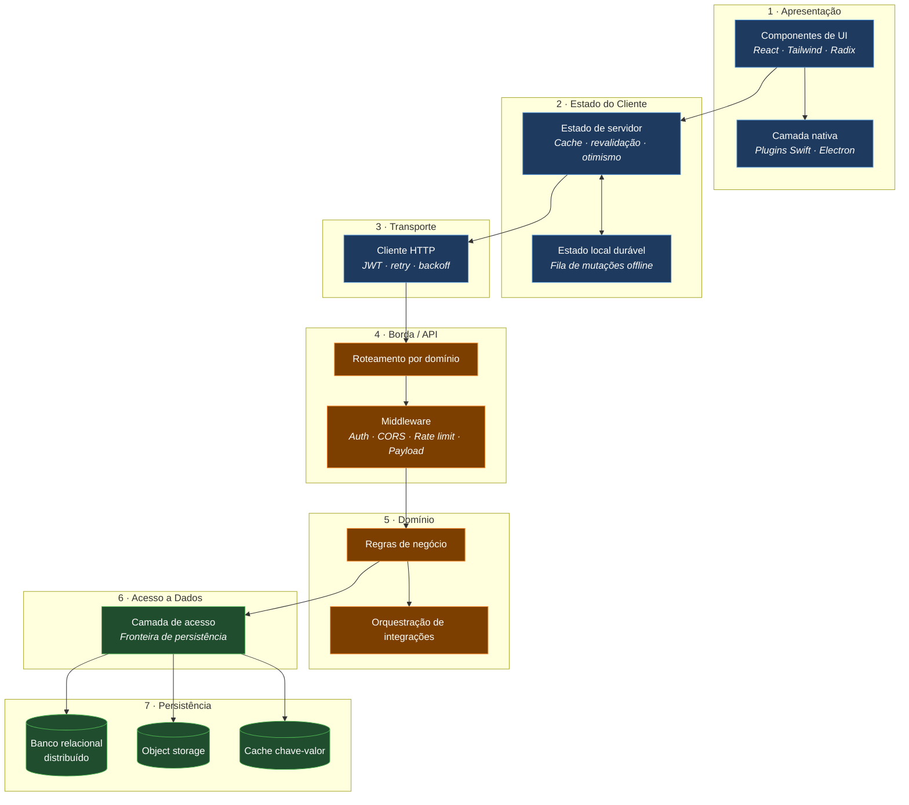
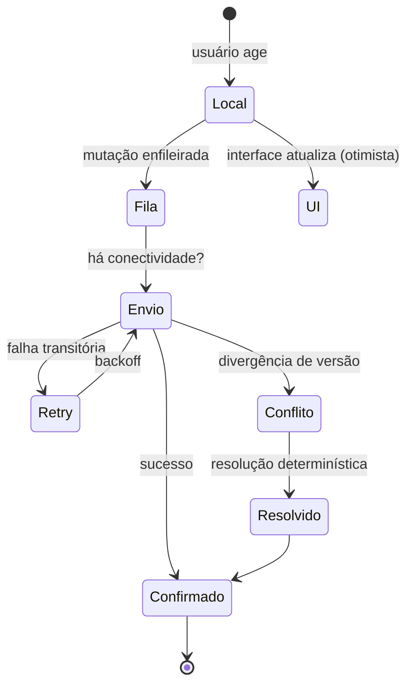
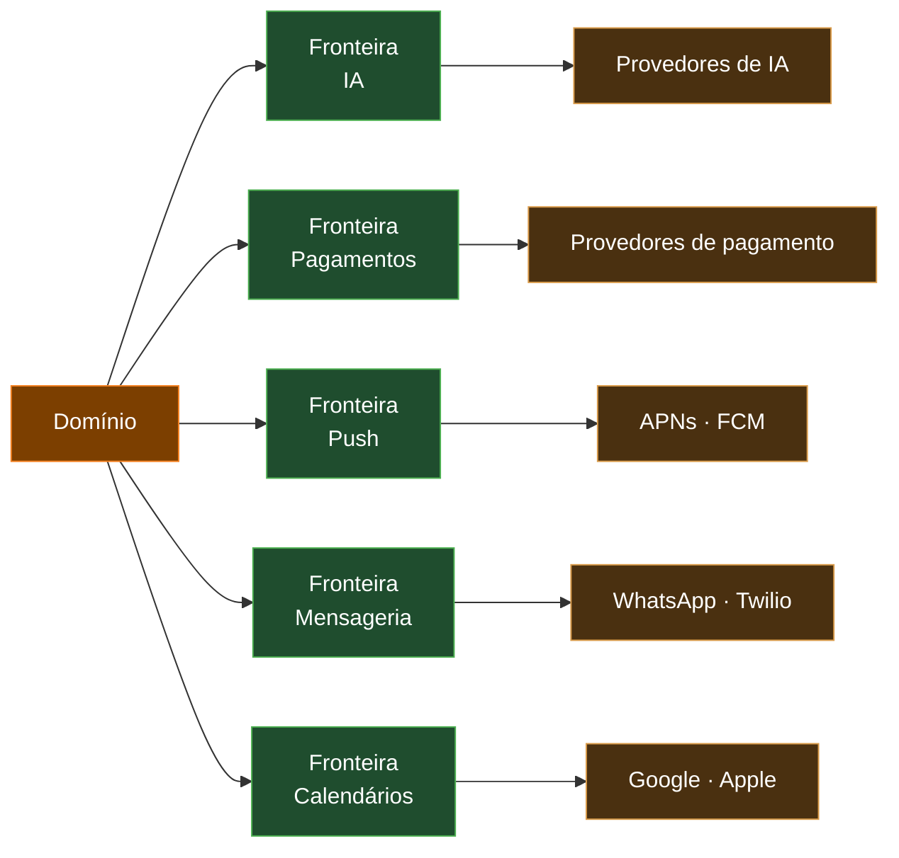

# Arquitetura

> Documento conceitual. Não contém código-fonte, endpoints reais, esquemas de produção nem lógica de
> negócio proprietária.

---

## Modelo arquitetural

O LodgeFlow segue uma arquitetura **serverless em camadas, distribuída na edge**, com clientes
offline-first e um núcleo de interface compartilhado entre plataformas.

---

## Camada 1 — Apresentação

Interface construída em React com TypeScript, estilizada por Tailwind CSS sobre primitivas acessíveis
do Radix UI.

A mesma camada de apresentação serve todas as plataformas. O que muda entre elas é o **invólucro**:
navegador na web, Capacitor no mobile, Electron no desktop.

**Adaptação por plataforma**, não duplicação:
- Layout responsivo cobre celular, tablet e desktop com o mesmo componente
- Navegação inferior no mobile, navegação lateral no desktop
- Atalhos de teclado ativos apenas onde há teclado
- Feedback tátil ativo apenas onde há motor háptico

### Camada nativa

Recursos sem equivalente web entram por plugins com superfície pequena e responsabilidade única:
calendário do sistema, chamadas nativas, widgets, atividades ao vivo, comandos de voz e compras
dentro do app. A camada React os consome por uma interface tipada, sem saber como estão implementados.

---

## Camada 2 — Estado do Cliente

Dois tipos de estado, com papéis distintos:

**Estado de servidor.** Gerenciado por uma biblioteca de cache com revalidação, que trata dados
remotos como cache com política de invalidação — não como estado da aplicação. Isso remove a
necessidade de sincronizar manualmente o que veio da rede e habilita atualização otimista de forma
consistente.

**Estado local durável.** A fila de mutações offline. Sobrevive ao fechamento do app e à
reinicialização do dispositivo, e é drenada em ordem quando a conectividade retorna.

### Estratégia offline

Cada registro tem três estados visíveis: **local**, **em sincronização** e **confirmado**. A interface
representa os três, para que o usuário nunca fique em dúvida sobre o que já foi salvo.

---

## Camada 3 — Transporte

Cliente HTTP único, responsável por anexar o token de autenticação, renovar a credencial de forma
transparente quando ela expira, aplicar retry com backoff em falhas transitórias e detectar mudança
de conectividade.

Toda comunicação usa HTTPS. Nenhuma requisição sai da aplicação sem passar por esta camada.

---

## Camada 4 — Borda / API

O ponto de entrada do backend. Roda como funções efêmeras distribuídas globalmente, sem servidores
persistentes.

### Roteamento por domínio

As rotas são agrupadas por área funcional — identidade, dados, IA, cobrança, notificações,
integrações e administração — com um módulo por responsabilidade em vez de um arquivo monolítico.
Isso mantém cada rota pequena, testável e substituível.

### Middleware

Aplicado de forma consistente e na ordem correta, antes de qualquer lógica:

| Middleware | Função |
|---|---|
| **CORS** | Restringe origens permitidas |
| **Limite de payload** | Rejeita requisições acima do teto antes de processar o corpo |
| **Autenticação** | Valida o token e resolve a identidade |
| **Rate limiting** | Limita por identidade e por rota, mais estrito nas rotas caras |
| **Validação** | Verifica o payload contra esquema antes de chegar ao domínio |

A ordem importa: rejeitar cedo o que é inválido evita gastar computação com requisições que já
falharam.

### Trabalho agendado

Jobs periódicos rodam no mesmo runtime, disparados por agendador da plataforma: envio de lembretes,
sincronizações incrementais, limpeza de dados frios, reengajamento e reconciliação de assinaturas.

Todo job é **idempotente** e **fatiado em lotes retomáveis** — ele pode ser reexecutado sem efeito
duplicado, e uma interrupção não perde o progresso.

---

## Camada 5 — Domínio

Onde vivem as regras do produto. Isolada tanto do protocolo HTTP quanto dos detalhes de persistência,
o que a torna a parte mais estável e testável do sistema.

### Orquestração de integrações

Cada serviço externo fica atrás de sua própria fronteira, que encapsula credenciais, formato de
requisição, limites do provedor e tratamento de erro.

O benefício prático: trocar um provedor, adicionar um segundo ou lidar com a indisponibilidade de um
deles é um trabalho contido em uma fronteira, sem tocar no domínio.

---

## Camada 6 — Acesso a Dados

Uma fronteira explícita entre o domínio e o banco. Nenhuma regra de negócio escreve consulta
diretamente.

Essa camada pareceu excesso de zelo no início do projeto e provou seu valor na migração da plataforma
de dados: foi possível manter dois destinos vivos simultaneamente durante a transição e remover o
antigo depois, sem reescrever o domínio.

---

## Camada 7 — Persistência

| Recurso | Uso |
|---|---|
| **Banco relacional distribuído** | Dados estruturados do produto, colocalizado com a computação |
| **Object storage** | Anexos e arquivos enviados pelo usuário |
| **Cache chave-valor** | Dados efêmeros, estados temporários e controle de limites |

Migrações são versionadas em SQL e aplicadas de forma controlada, com índices desenhados a partir dos
padrões de consulta reais.

---

## Padrões transversais

| Padrão | Onde se aplica |
|---|---|
| **Timeout** | Toda chamada externa tem prazo definido |
| **Retry com backoff** | Falhas transitórias, no cliente e no servidor |
| **Idempotência** | Operações sensíveis e todo consumo de webhook |
| **Degradação graciosa** | Falha de recurso secundário não derruba o principal |
| **Fallback de provedor** | Redirecionamento quando um provedor de IA falha |
| **Logging estruturado** | Sem dados pessoais, com alertas nos caminhos críticos |
| **Feature flags** | Ativação gradual de funcionalidades |

---

## Ver também

- [../SYSTEM_DESIGN.md](../SYSTEM_DESIGN.md) — por que cada decisão foi tomada
- [backend.md](backend.md) — detalhamento da camada serverless
- [mobile.md](mobile.md) — detalhamento da camada mobile
- [database.md](database.md) — modelo de dados conceitual
- [diagrams/](diagrams/) — diagramas adicionais
