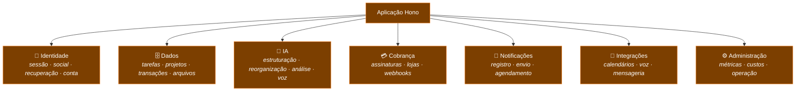
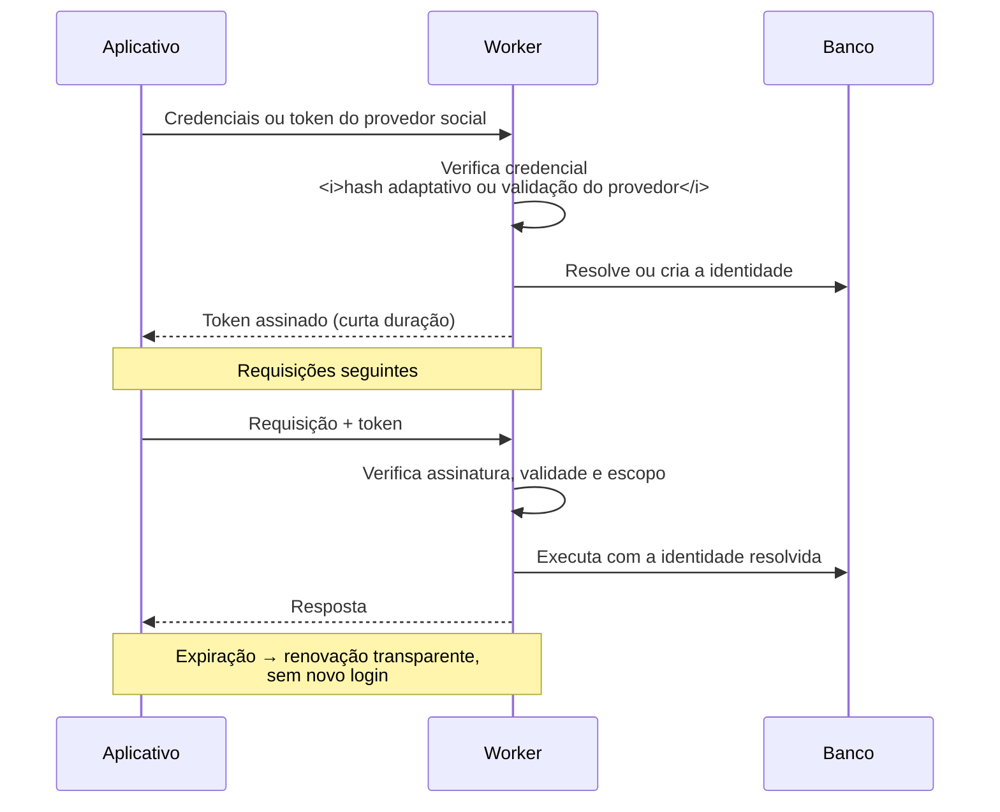

# Backend

> Documento conceitual. Não contém código-fonte, endpoints reais, esquemas de produção, credenciais
> nem lógica de negócio proprietária.

---

## Modelo de execução

O backend do LodgeFlow não roda em servidores. Ele roda como **funções efêmeras distribuídas
globalmente** na rede da Cloudflare, executando no ponto de presença mais próximo de quem fez a
requisição.

A diferença em relação a serverless baseado em containers é o mecanismo de isolamento: **isolates V8**
em vez de containers por invocação. Isso remove o cold start da equação — subir um isolate custa
milissegundos, não segundos.

Consequências que moldam todo o código:

| Restrição | Como o sistema lida |
|---|---|
| **Sem estado entre requisições** | Todo estado mora explicitamente no banco, no cache ou no cliente |
| **Sem conexões persistentes** | O acesso a dados é feito pelo binding da plataforma, sem pool |
| **Tempo de execução limitado** | Operações longas são fatiadas em unidades retomáveis |
| **Sem processos em segundo plano** | Trabalho periódico é modelado como job agendado idempotente |
| **APIs de Node indisponíveis** | Só APIs web padrão; bibliotecas precisam ser compatíveis com edge |

---

## Camada HTTP — Hono

Workers expõem uma API baixa demais para construir um produto inteiro. **Hono** foi escolhido como
framework de roteamento por ser projetado para runtimes de edge desde a origem: bundle mínimo, sem
dependência de APIs do Node, tipagem forte e middleware componível.

### Organização por domínio

As rotas são agrupadas por área funcional, com um módulo por responsabilidade:

Cada módulo é pequeno, testável e substituível. Não existe um arquivo central com todas as rotas.

> Os nomes acima descrevem **áreas funcionais**, não caminhos de URL. Um exemplo fictício de contrato
> de API está em [`../api/openapi-example.yaml`](../api/openapi-example.yaml).

### Middleware

Aplicado antes de qualquer lógica de domínio, na ordem em que rejeitar cedo custa menos:

1. **CORS** — restringe origens permitidas
2. **Limite de payload** — rejeita requisições grandes antes de ler o corpo inteiro
3. **Autenticação** — valida o token e resolve a identidade
4. **Rate limiting** — limita por identidade e por rota
5. **Validação de esquema** — verifica o payload antes de o domínio recebê-lo

---

## Autenticação — JWT

A autenticação usa **JSON Web Tokens** assinados, com verificação criptográfica na borda.

### Como funciona conceitualmente

**Propriedades do desenho:**

- Tokens têm **vida curta** — a janela de exposição de um token vazado é pequena
- A renovação é **transparente** — o usuário não é deslogado por expiração
- A verificação é **stateless** — não há consulta ao banco para validar assinatura, o que preserva a
  latência da edge
- Senhas usam **hash com custo adaptativo**, nunca armazenamento reversível
- Login social usa os **fluxos nativos** de cada plataforma, com validação do token do provedor no
  servidor — o cliente nunca é fonte de verdade sobre identidade
- Contas administrativas exigem **segundo fator**

---

## Autorização

Separada da autenticação. Saber *quem* é o usuário não diz *o que* ele pode fazer.

| Regra | Aplicação |
|---|---|
| **Propriedade por registro** | Todo acesso a dado verifica a titularidade no servidor |
| **Entitlement por plano** | O que o usuário pode fazer vem do estado de assinatura, resolvido no servidor |
| **Quota antes da execução** | Operações caras verificam limite **antes** de executar, não depois |
| **Cliente nunca decide** | Nenhuma permissão é inferida de informação enviada pelo aplicativo |

---

## Persistência — D1

**Cloudflare D1** é um banco relacional (SQLite) distribuído, colocalizado com o runtime dos Workers.
A consulta não atravessa a internet pública para chegar ao banco — a principal fonte de latência em
arquiteturas serverless tradicionais deixa de existir.

### Práticas adotadas

- **Migrations versionadas em SQL**, aplicadas de forma controlada e ordenada
- **Índices desenhados a partir dos padrões de consulta reais**, revisados quando o acesso muda
- **Consultas sempre delimitadas** por usuário e janela de tempo — nenhuma varredura global
- **Consultas parametrizadas** sempre; nenhuma construção de SQL por concatenação
- **Fronteira de acesso a dados** entre o domínio e o banco, para que o motor seja substituível
- **Separação de dados quentes e frios**, com rotina periódica de limpeza

O modelo de dados conceitual está em [database.md](database.md).

---

## Armazenamento de objetos — R2

Anexos e arquivos enviados pelo usuário ficam em **object storage**, não no banco relacional.

Motivos: arquivos binários degradam a performance de um banco relacional, escalam mal em replicação
e inflam backups. O object storage também elimina o custo de saída de dados, que costuma ser a maior
surpresa de custo em armazenamento na nuvem.

O acesso é sempre mediado — a autorização é verificada no Worker antes de qualquer leitura ou escrita.

---

## Cache e dados efêmeros — KV

Armazenamento chave-valor distribuído, usado para o que é temporário por natureza: estados
intermediários de fluxos OAuth, contadores de limite de requisição, chaves de idempotência e dados de
alta leitura e baixa escrita.

A escolha entre banco relacional e KV segue uma regra simples: **se o dado tem relação com outros
dados, vai para o banco; se é uma entrada isolada com tempo de vida definido, vai para o KV.**

---

## Trabalho agendado — Cron Triggers

Como não há processos de longa duração, todo trabalho periódico é disparado pelo agendador da
plataforma e executa no mesmo runtime.

**Categorias de job em operação:**

| Categoria | Propósito |
|---|---|
| **Lembretes** | Verifica compromissos próximos e dispara os canais adequados |
| **Sincronizações** | Reconcilia calendários externos de forma incremental |
| **Reconciliação de assinaturas** | Confere o estado de acesso contra os provedores de pagamento |
| **Limpeza** | Remove dados expirados e arquiva dados frios |
| **Reengajamento** | Comunicação com usuários inativos |
| **Notificações de integrações** | Entrega em canais externos conectados |

### Regras obrigatórias para todo job

1. **Idempotente** — pode reexecutar sem produzir efeito duplicado
2. **Fatiado em lotes** — nunca varre a base inteira em uma execução
3. **Retomável** — uma interrupção não perde o progresso já feito
4. **Observável** — registra progresso e falhas de forma estruturada

Essa disciplina é o que permite que o mesmo desenho funcione com mil ou com cem mil usuários.

---

## Resiliência

Com integrações a mais de dez provedores externos, algum estará indisponível em algum momento. O
backend assume isso.

| Padrão | Aplicação |
|---|---|
| **Timeout** | Toda chamada externa tem prazo; nada espera indefinidamente |
| **Retry com backoff** | Falhas transitórias são reprocessadas com espaçamento crescente |
| **Idempotência** | Chave de idempotência em operações sensíveis e webhooks |
| **Degradação graciosa** | Falha de recurso secundário não derruba o principal |
| **Fallback de provedor** | Pedido de IA é redirecionado quando um provedor falha |
| **Circuit awareness** | Provedor com falha persistente deixa de ser tentado por um período |

---

## Observabilidade

- **Logging estruturado**, sem dados pessoais nos registros
- **Métricas de uso e custo** por operação de IA, com visibilidade administrativa
- **Alertas** nos caminhos críticos: falha de pagamento, falha de entrega, erro de integração
- **Rastreamento de erros** com contexto suficiente para diagnóstico, sem expor dados do usuário

---

## Gestão de segredos

Nenhum segredo é versionado. Chaves de API, credenciais de provedores e material criptográfico são
injetados pelo gerenciador de segredos da plataforma e acessados apenas em tempo de execução.

O repositório mantém apenas um **template sem valores** —
[`../templates/env.example`](../templates/env.example) — documentando quais variáveis existem, nunca
o que elas contêm.

---

## Ver também

- [../SYSTEM_DESIGN.md](../SYSTEM_DESIGN.md) — por que Workers, por que serverless
- [database.md](database.md) — modelo de dados conceitual
- [security.md](security.md) — modelo de segurança
- [deployment.md](deployment.md) — build e publicação
