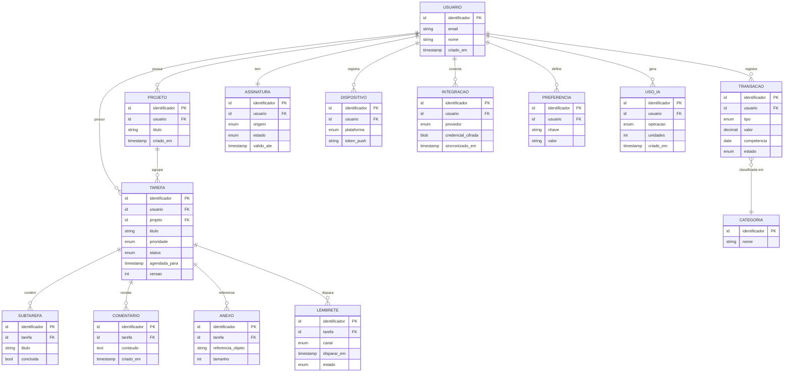

# Modelo de Dados

> ⚠️ **Documento conceitual.** O diagrama e as descrições abaixo são uma **representação simplificada
> e ilustrativa**. Não correspondem ao esquema real do LodgeFlow: nomes de tabelas, colunas, tipos,
> índices, chaves e relacionamentos estratégicos foram deliberadamente omitidos ou generalizados.
>
> O objetivo é demonstrar **raciocínio de modelagem**, não permitir a reprodução do sistema.

---

## Motor de banco de dados

**Cloudflare D1** — um banco relacional SQLite distribuído, colocalizado com o runtime dos Workers.

### Por que relacional

O domínio do LodgeFlow é predominantemente relacional: tarefas pertencem a projetos, subtarefas
pertencem a tarefas, transações pertencem a categorias, tudo pertence a um usuário. Consultas típicas
envolvem junções e filtros por período. Um banco de documentos exigiria desnormalização e
consistência aplicada na aplicação — trabalho extra sem benefício correspondente.

### Por que SQLite distribuído

A propriedade decisiva é a **colocalização com a computação**. A consulta não atravessa a internet
pública para chegar ao banco, o que elimina a maior fonte de latência em arquiteturas serverless
tradicionais.

O trade-off aceito: não há o ecossistema, as extensões nem os tipos avançados do PostgreSQL. Para
este modelo de dados, SQLite é suficiente — e a fronteira de acesso a dados existe justamente para
que essa decisão seja revisável.

---

## Diagrama ER simplificado

> Entidades e campos acima são **ilustrativos**. O esquema de produção difere em nomes, estrutura e
> relacionamentos.

---

## Princípios de modelagem

### 1. Tudo pertence a um usuário

Toda entidade de produto tem um vínculo direto ou transitivo com o usuário dono. Isso não é
conveniência — é a base do modelo de autorização e do modelo de performance:

- **Autorização:** a verificação de propriedade é sempre possível, sem lógica especial por caso
- **Performance:** toda consulta pode ser delimitada por usuário, o que impede varreduras globais

### 2. Identificadores gerados no cliente

Chaves primárias são geradas pelo **dispositivo**, não pelo banco.

É uma consequência direta do offline-first: um registro criado sem rede precisa de identidade
imediata para ser referenciado por outros registros locais. Se o identificador viesse do banco, nada
criado offline poderia ser relacionado a nada.

### 3. Metadados de versão para reconciliação

Registros sincronizáveis carregam informação de versão e origem. Quando dois dispositivos alteram o
mesmo registro sem terem se visto, a resolução é **determinística** — ambos convergem para o mesmo
resultado, em vez de o resultado depender de quem chegou por último por acaso.

### 4. Exclusão lógica onde a sincronização exige

Alguns registros são marcados como removidos em vez de apagados imediatamente. Sem isso, um
dispositivo offline não teria como distinguir "este registro foi deletado em outro aparelho" de "este
registro ainda não chegou até mim" — e recriaria o que foi apagado.

A remoção física acontece depois, na rotina de limpeza.

### 5. Arquivos fora do banco relacional

O banco guarda apenas a **referência** ao objeto; o conteúdo vive no object storage. Binários grandes
degradam performance de consulta, inflam backups e escalam mal em replicação.

### 6. Dados quentes separados de dados frios

Registros ativos e históricos têm caminhos de acesso diferentes. Dados frios são arquivados por
rotina periódica, mantendo as tabelas quentes pequenas e as consultas rápidas.

---

## Estratégia de índices

Índices são desenhados a partir dos **padrões de consulta reais**, medidos, não por intuição.

| Padrão de acesso | Consequência de índice |
|---|---|
| Sempre filtrado por usuário | O usuário é a primeira coluna de praticamente todo índice composto |
| Frequentemente filtrado por período | Índices compostos de usuário + tempo |
| Filtrado por estado | Índices parciais onde a distribuição de valores justifica |
| Junções entre entidades relacionadas | Chaves estrangeiras indexadas |

Índices não são gratuitos: cada um custa escrita e espaço. Eles são adicionados quando uma consulta
real justifica, e revisados quando o padrão de acesso muda.

---

## Migrations

O esquema evolui por **migrations versionadas em SQL**, aplicadas em ordem e de forma controlada.

Regras adotadas:

- Toda mudança de esquema é uma migration versionada, nunca uma alteração manual
- Migrations são **aditivas por padrão** — colunas e tabelas novas antes de remover as antigas
- Mudanças que quebram compatibilidade seguem em **duas fases**: primeiro o novo caminho passa a
  existir junto com o antigo, depois o antigo é removido, quando nenhum cliente o usa mais
- Índices de performance são migrations próprias, separadas de mudanças estruturais

A segunda regra é o que permite atualizar o backend sem quebrar aplicativos de versões anteriores
ainda instalados nos dispositivos — algo inevitável em produtos distribuídos por lojas, onde o
usuário controla quando atualiza.

---

## Consistência

| Aspecto | Abordagem |
|---|---|
| **Dentro de uma requisição** | Transacional |
| **Entre dispositivos** | Consistência eventual, com convergência determinística |
| **Com serviços externos** | Reconciliação periódica por job idempotente |
| **Estado de assinatura** | Servidor é a única fonte de verdade; o cliente nunca decide |

---

## Ver também

- [backend.md](backend.md) — camada de acesso a dados
- [architecture.md](architecture.md) — camadas de persistência
- [../SYSTEM_DESIGN.md](../SYSTEM_DESIGN.md) — por que este motor de banco
