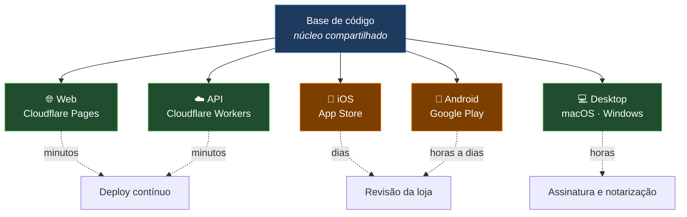
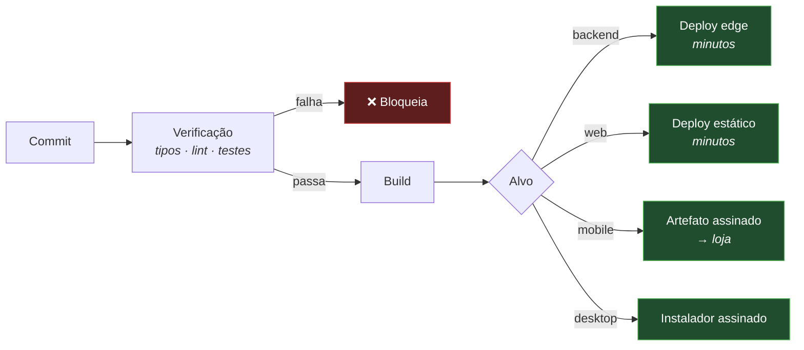

# Publicação e Deploy

> ⚠️ **Documento conceitual.** Não contém o pipeline real, credenciais, identificadores de
> aplicativo, certificados, nomes de projeto na nuvem nem comandos de deploy de produção.
>
> Descreve a **estratégia** de publicação, não a sua execução.

---

## Alvos de distribuição

O LodgeFlow é publicado em cinco destinos, cada um com seu próprio ciclo, requisitos e prazo.

A diferença de velocidade entre os alvos é o fato mais importante do processo de publicação — e a
raiz da regra de compatibilidade descrita adiante.

---

## Backend — Cloudflare Workers

O deploy do backend é o mais simples e o mais rápido: o código é empacotado e distribuído para a rede
global em minutos, sem servidores a provisionar, sem janela de manutenção e sem indisponibilidade.

### Práticas adotadas

| Prática | Descrição |
|---|---|
| **Ambientes separados** | Desenvolvimento, homologação e produção com dados isolados |
| **Desenvolvimento local fiel** | O runtime local reproduz o de produção, não o simula |
| **Migrations antes do código** | O esquema é atualizado antes do código que depende dele |
| **Segredos pelo cofre da plataforma** | Nunca no repositório, nunca no bundle |
| **Feature flags** | Funcionalidades ativadas gradualmente e desativáveis sem novo deploy |
| **Logs em tempo real** | Acompanhamento imediato após cada publicação |
| **Rollback rápido** | Retorno à versão anterior em minutos |

### Ordem de deploy

A sequência importa quando o backend evolui mais rápido que os clientes:

1. **Migrations** — o esquema passa a suportar o novo e o antigo
2. **Backend** — o código novo é publicado, ainda compatível com clientes antigos
3. **Clientes** — web imediatamente, mobile e desktop no ritmo das lojas
4. **Limpeza** — o caminho antigo só é removido quando nenhum cliente o utiliza

---

## Compatibilidade retroativa — a restrição central

Em um produto distribuído por lojas, **o usuário decide quando atualizar**. Sempre haverá aparelhos
rodando versões antigas do aplicativo contra o backend mais recente.

Isso torna a compatibilidade retroativa uma obrigação, não uma cortesia:

- Mudanças de contrato de API são **aditivas por padrão**
- Campos são adicionados antes de qualquer campo ser removido
- Remoções acontecem apenas quando a telemetria confirma que nenhum cliente ativo depende do campo
- O mesmo princípio de duas fases vale para migrations de banco

É a mesma disciplina descrita em [database.md](database.md#migrations), aplicada à camada de API.

---

## Web — Cloudflare Pages

Aplicação e site publicados como assets estáticos na rede global, com build otimizado: divisão de
código, tree-shaking, compressão e cache de longa duração com invalidação por hash de conteúdo.

O deploy é contínuo e sem indisponibilidade — a versão nova passa a ser servida, a antiga sai de
circulação.

---

## iOS — App Store

O alvo com o ciclo mais longo e mais requisitos.

### Etapas

1. Build de produção do núcleo web
2. Sincronização dos assets para o projeto nativo
3. Compilação do projeto iOS com os plugins nativos
4. Assinatura com os certificados de distribuição
5. Envio para o TestFlight
6. Validação interna
7. Submissão para revisão da App Store
8. Publicação, imediata ou agendada

### Requisitos que exigem atenção

| Requisito | Observação |
|---|---|
| **Privacidade** | Declaração completa de uso de dados no cadastro do app |
| **Compras no app** | Bens digitais precisam usar o sistema de compra da Apple |
| **Permissões** | Cada permissão exige justificativa clara ao usuário |
| **Recursos especiais** | VoIP push, widgets e Live Activities têm requisitos próprios |
| **Prazo de revisão** | Dias, não minutos — planejado no cronograma de release |

O prazo de revisão é o motivo pelo qual **feature flags** importam tanto: elas permitem desacoplar o
momento do envio do momento da ativação de uma funcionalidade.

---

## Android — Google Play

Processo análogo, com particularidades próprias:

1. Build de produção do núcleo web
2. Sincronização para o projeto nativo
3. Compilação do bundle de aplicação assinado
4. Envio para faixa de teste interno
5. Promoção gradual: teste interno → fechado → aberto → produção
6. **Lançamento escalonado** — a atualização chega a uma fração da base primeiro

O lançamento escalonado é uma rede de proteção real: um problema detectado com 5% da base afeta 5% da
base, e a distribuição pode ser interrompida antes de alcançar o restante.

---

## Desktop — macOS e Windows

| Plataforma | Requisitos |
|---|---|
| **macOS** | Assinatura com certificado de desenvolvedor + **notarização** pela Apple |
| **Windows** | Assinatura de código para evitar avisos do SmartScreen |

Notarização e assinatura são, na prática, a parte difícil de distribuir aplicativos desktop —
tecnicamente triviais, mas com muitos detalhes de credenciamento e verificação. Foi um dos motivos de
Electron ter sido escolhido: a cadeia de ferramentas para isso é madura.

Atualizações são entregues pelo mecanismo de auto-update do próprio aplicativo.

---

## CI/CD

> O pipeline real do LodgeFlow não é divulgado. O que segue descreve a **estrutura conceitual**.

### Portões de qualidade

Antes de qualquer build de produção:

- **Verificação de tipos** em modo estrito
- **Lint** com as regras do projeto
- **Testes** unitários e de integração
- **Auditoria de dependências**
- **Verificação de segredos** — nenhuma credencial pode entrar no bundle

---

## Ambientes

| Ambiente | Propósito | Dados |
|---|---|---|
| **Local** | Desenvolvimento | Isolados, sem dados reais |
| **Homologação** | Validação antes de produção | Isolados, representativos |
| **Produção** | Usuários finais | Reais |

Nenhum dado de produção é copiado para ambientes inferiores. Cenários de teste usam dados sintéticos.

---

## Monitoramento pós-deploy

- **Logs em tempo real** acompanhados na janela seguinte a cada publicação
- **Alertas** nos caminhos críticos: pagamento, entrega de notificação, integrações
- **Métricas de custo de IA**, para detectar consumo anômalo cedo
- **Rastreamento de erros** por versão de cliente, o que torna regressões atribuíveis

---

## Estratégia de rollback

| Alvo | Rollback |
|---|---|
| **Backend** | Retorno à versão anterior em minutos |
| **Web** | Retorno ao build anterior |
| **Mobile** | Não há rollback pelas lojas — mitigado por feature flags e lançamento escalonado |
| **Desktop** | Distribuição da versão anterior via auto-update |

A linha do mobile é a mais importante: **não existe desfazer**. Uma versão publicada não pode ser
retirada dos aparelhos que já a instalaram. É por isso que a estratégia real de mitigação no mobile
não é rollback — é controle remoto de funcionalidade por flags e exposição gradual.

---

## Ver também

- [backend.md](backend.md) — runtime e trabalho agendado
- [mobile.md](mobile.md) — camada nativa
- [security.md](security.md) — segurança na cadeia de build
- [../SYSTEM_DESIGN.md](../SYSTEM_DESIGN.md) — decisões arquiteturais
