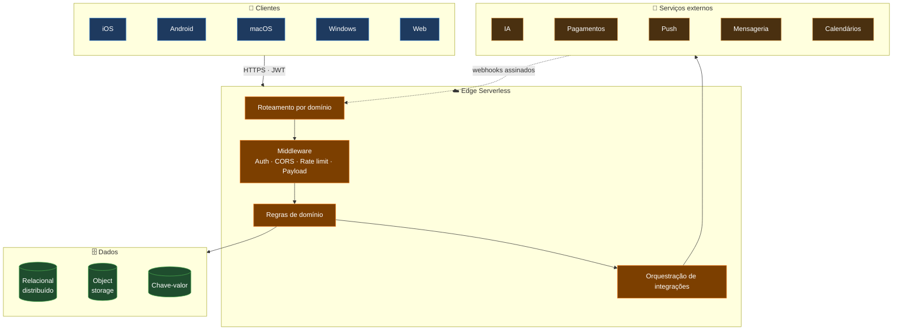
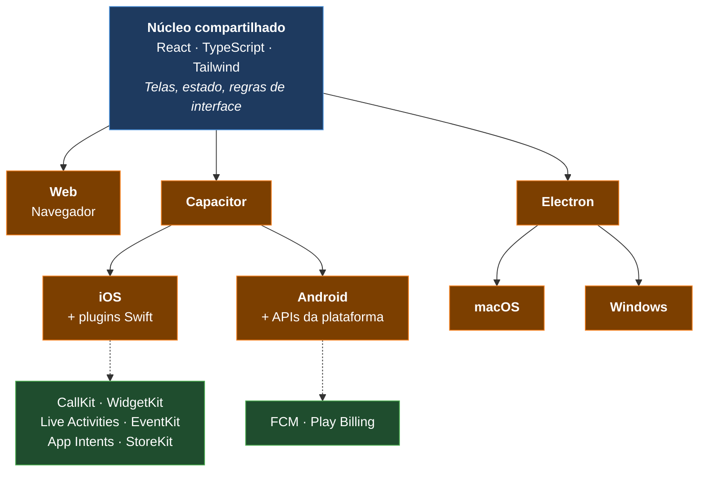
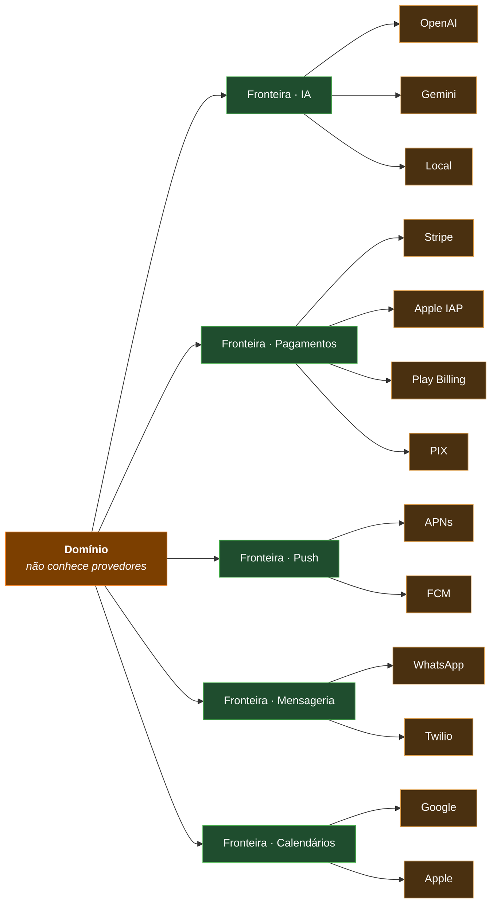

# Diagrama — Arquitetura

> Diagramas em Mermaid, renderizados nativamente pelo GitHub. Representação **conceitual**.

---

## Visão geral em camadas

---

## Compartilhamento de código entre plataformas

---

## Isolamento de integrações

Cada fronteira encapsula credenciais, formato de requisição, limites do provedor e tratamento de
erro. Trocar, adicionar ou perder um provedor é um trabalho contido — o domínio não é tocado.
