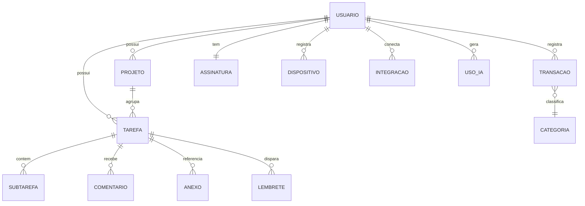
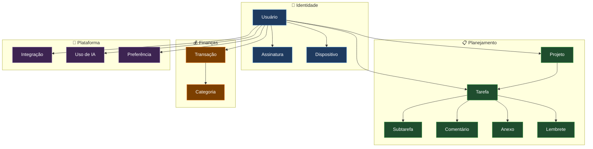
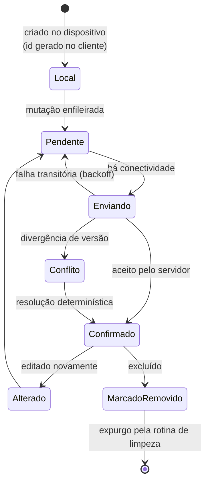
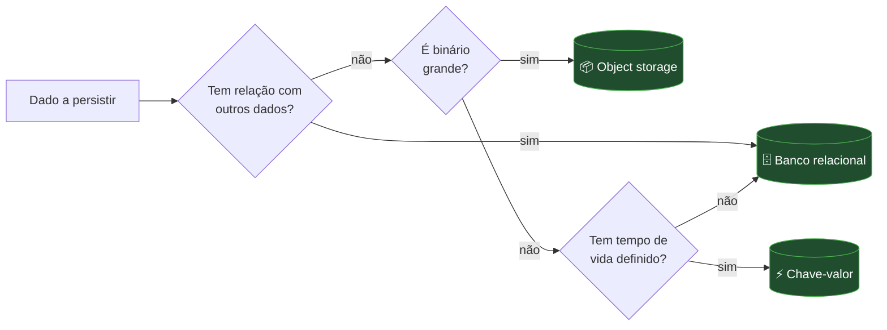

# Diagrama — Modelo de Dados

> ⚠️ **Representação ilustrativa.** Não corresponde ao esquema real do LodgeFlow. Nomes, campos e
> relacionamentos foram generalizados de propósito. Consulte [../database.md](../database.md) para os
> princípios de modelagem.

---

## Entidades e relacionamentos (simplificado)

---

## Agrupamento por domínio

Note que **toda entidade tem caminho até o usuário**. Isso não é acidente de modelagem — é a base
simultânea do modelo de autorização (a propriedade é sempre verificável) e do modelo de performance
(toda consulta pode ser delimitada por usuário).

---

## Ciclo de vida de um registro sincronizável

Dois detalhes explicam decisões descritas em [../database.md](../database.md):

- O identificador nasce **no dispositivo**, senão um registro criado offline não poderia ser
  referenciado por outros registros locais.
- A exclusão é **lógica antes de física**, senão um dispositivo offline não distinguiria "foi
  apagado em outro aparelho" de "ainda não chegou até mim" — e recriaria o registro.

---

## Armazenamento por tipo de dado

