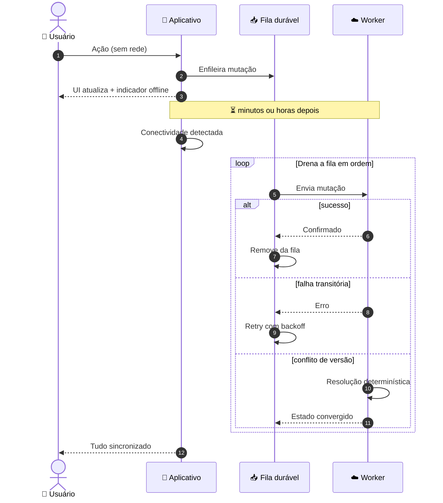
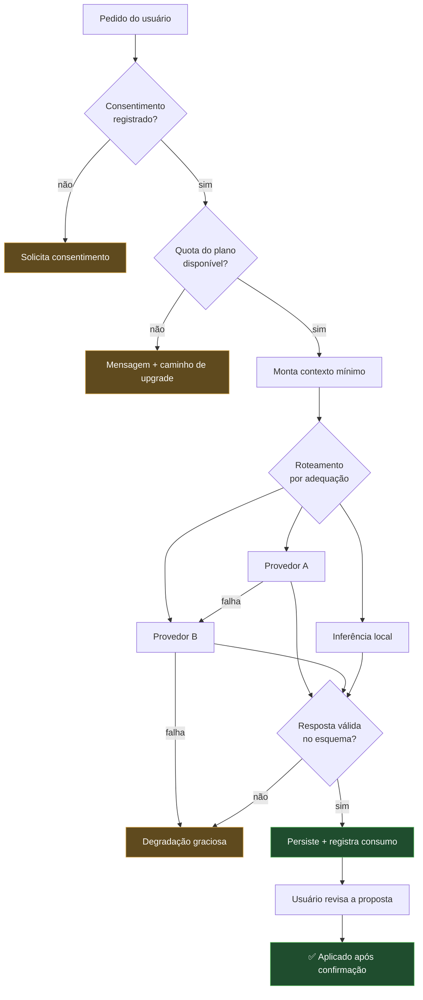
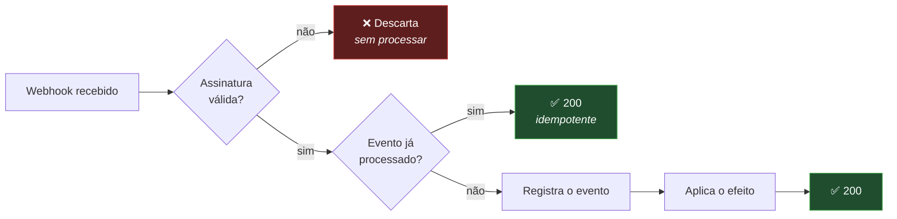
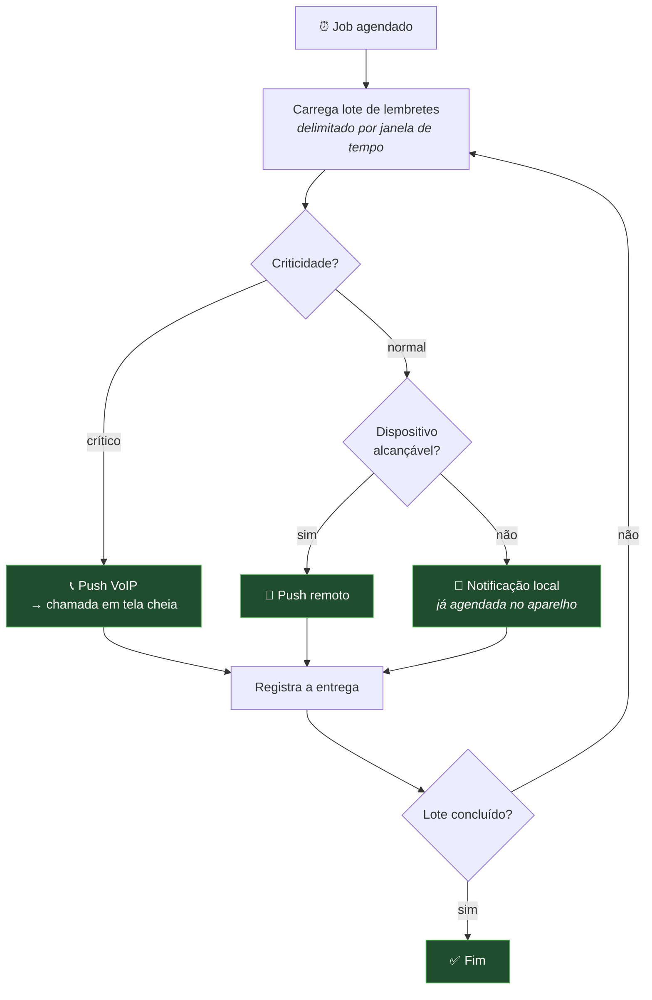

# Diagrama — Fluxo de Requisição

> Diagramas em Mermaid. Representação **conceitual** — nenhum endpoint real é mostrado.

---

## Caminho de uma requisição autenticada

```mermaid
sequenceDiagram
    autonumber
    actor U as 👤 Usuário
    participant A as 📱 Aplicativo
    participant L as 💾 Store local
    participant W as ☁️ Worker
    participant DB as 🗄 Banco

    U->>A: Ação
    A->>L: Grava localmente
    A-->>U: UI atualiza (otimista)

    A->>W: Requisição + JWT

    rect rgb(40, 40, 55)
        Note over W: Middleware — rejeita cedo
        W->>W: CORS
        W->>W: Limite de payload
        W->>W: Verifica assinatura do token
        W->>W: Rate limit por identidade e rota
        W->>W: Validação de esquema
    end

    rect rgb(35, 50, 40)
        Note over W,DB: Domínio
        W->>DB: Verifica propriedade do registro
        DB-->>W: OK
        W->>DB: Executa a operação
        DB-->>W: Resultado
    end

    W-->>A: Resposta
    A->>L: Reconcilia estado local
    A-->>U: Estado confirmado
```

---

## Caminho sem conectividade

---

## Operação de IA

---

## Consumo de webhook

A verificação de assinatura vem **antes** de qualquer processamento. Um payload sem assinatura válida
nunca chega a tocar o domínio.

---

## Entrega de lembrete

O laço de lote é o que mantém o job dentro do limite de execução do runtime e permite retomada em
caso de interrupção.
