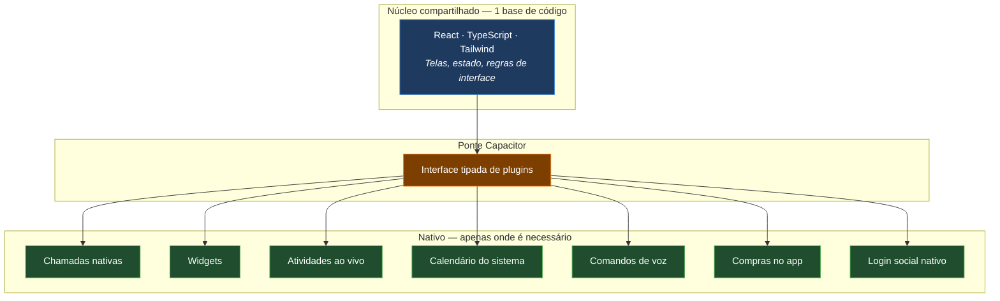
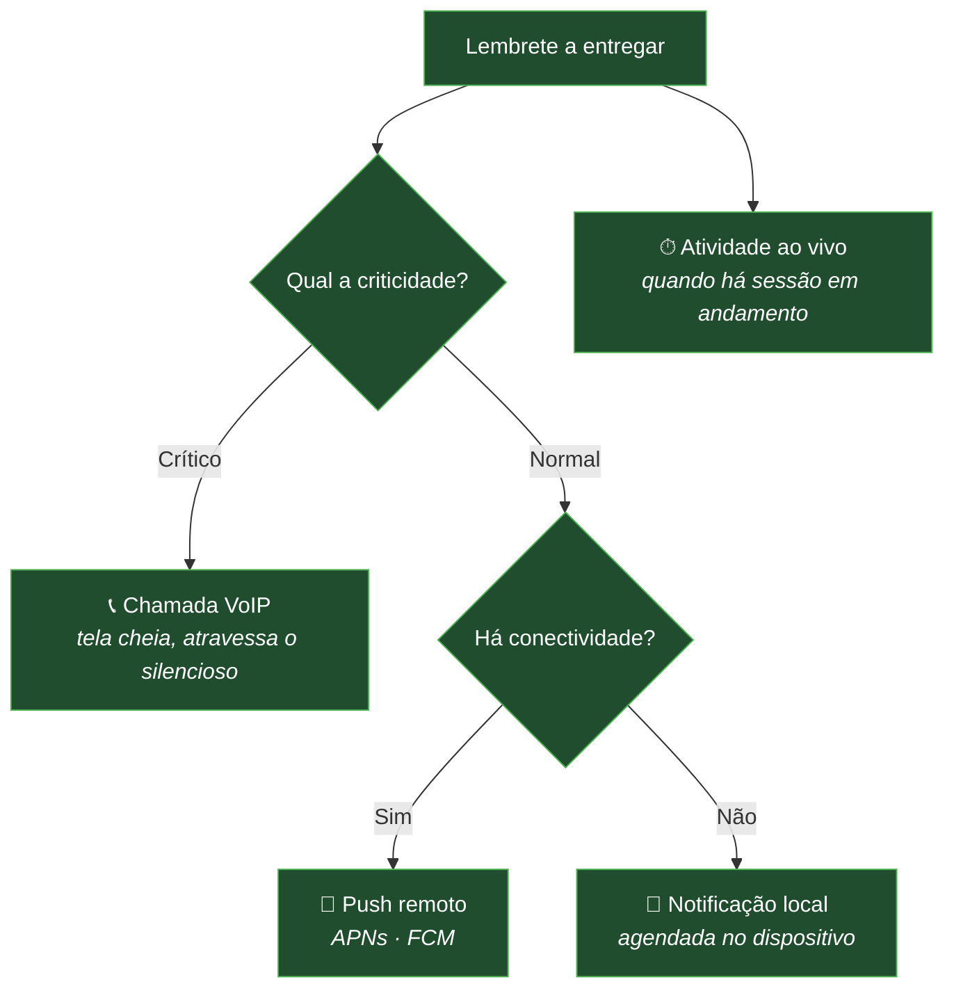

# Mobile

> Documento conceitual. Não contém código-fonte, identificadores de aplicativo, certificados nem
> lógica de negócio proprietária.

---

## Estratégia

O LodgeFlow roda em iOS e Android a partir do **mesmo núcleo React** que serve a web e o desktop,
empacotado por **Capacitor**, com **plugins nativos em Swift** para o que não tem equivalente web.

A pergunta que guiou a escolha não foi *"qual framework é melhor?"*, e sim *"onde o usuário percebe a
diferença entre web e nativo?"*.

Na maior parte da aplicação — listas, formulários, calendário, gráficos, chat — a resposta é **em
lugar nenhum**, desde que animações, gestos e feedback tátil estejam corretos. A diferença aparece em
um conjunto pequeno e bem delimitado de recursos, e é exatamente ali que entra código nativo.

**Consequência prática:** uma funcionalidade nova de produto custa **uma** implementação, não cinco.
Só recursos genuinamente nativos exigem trabalho por plataforma — e eles são a minoria.

---

## Camada React

A mesma base de componentes da web, com adaptações de plataforma em vez de duplicação:

| Aspecto | Adaptação |
|---|---|
| **Navegação** | Barra inferior no celular, painel lateral no tablet e desktop |
| **Gestos** | Deslizar para ações rápidas em listas; arrastar e soltar no planner |
| **Teclado** | Altura do teclado observada para evitar que campos fiquem cobertos |
| **Feedback tátil** | Háptico em ações de confirmação, apenas onde há motor |
| **Área segura** | Respeito ao notch, à Dynamic Island e à barra de gestos |
| **Tema** | Claro, escuro e acompanhamento da preferência do sistema |

Capacitor fornece os recursos de dispositivo de propósito geral: rede, notificações locais,
armazenamento, teclado, barra de status, tela de abertura, háptico, navegador embutido e tarefas em
segundo plano.

---

## Plugins nativos

Cada recurso nativo é um plugin com **superfície pequena e responsabilidade única**, chamado pela
camada React por uma interface tipada. A camada React não sabe como o plugin está implementado.

### Chamadas nativas — CallKit e PushKit

O recurso mais distintivo do produto. Um lembrete verdadeiramente crítico é entregue como uma
**chamada telefônica nativa em tela cheia**, não como uma notificação.

A diferença importa: uma notificação comum é silenciada pelo modo Não Perturbe e ignorada com
facilidade. Uma chamada atravessa esse filtro e ocupa a tela inteira, com a interface de chamada do
próprio sistema.

Tecnicamente, isso combina duas peças do iOS:
- **PushKit** — canal de push dedicado a VoIP, com prioridade de entrega mais alta
- **CallKit** — apresenta a chamada usando a interface nativa do sistema

O sistema operacional impõe uma regra rígida: um push VoIP recebido **precisa** resultar em uma
chamada reportada ao CallKit, sob pena de o app perder o direito de receber esses pushes. O plugin é
desenhado em torno dessa restrição.

### Widgets — WidgetKit

Acompanhamento do dia direto na tela inicial, sem abrir o aplicativo. Widgets rodam em um processo
separado com orçamento de execução limitado, então recebem dados **já preparados** por um contêiner
compartilhado, em vez de consultarem a rede por conta própria.

### Atividades ao vivo — Live Activities

O Pomodoro em andamento aparece na **Dynamic Island** e na tela de bloqueio, com contagem regressiva
em tempo real. É o mesmo princípio do widget, com um ciclo de vida próprio: iniciar, atualizar e
encerrar de forma explícita, respeitando os limites de frequência de atualização do sistema.

### Calendário do sistema — EventKit

Sincronização bidirecional com o calendário nativo do iOS.

Duas decisões importantes:
- **Permissão sob demanda e com contexto.** O acesso é solicitado quando o usuário ativa a
  funcionalidade, não na abertura do app.
- **Sincronização incremental.** Apenas o delta desde o último ponto conhecido é processado, com
  feedback de progresso na interface. Reprocessar o calendário inteiro seria lento e desnecessário.

### Comandos de voz — App Intents e Siri

Ações do produto expostas ao sistema como intenções, permitindo acioná-las pela Siri e por atalhos.
Cada intenção tem escopo pequeno e verificável, e a autorização é sempre validada no servidor — o
comando de voz não é uma via de acesso privilegiada.

### Compras no app — StoreKit

O iOS exige que assinaturas digitais sejam vendidas pelo sistema de compra da Apple. O plugin
apresenta os produtos e conduz a compra; a **validação do recibo acontece no servidor**, nunca no
dispositivo.

Essa separação é essencial: um recibo validado apenas no cliente é trivialmente falsificável. O
aplicativo pergunta ao servidor o que o usuário pode fazer; ele nunca decide por conta própria.

### Login social nativo

Sign in with Apple e Google Sign-In usam os **SDKs nativos**, não fluxos por webview. Isso preserva a
integração com o gerenciador de senhas e o Face ID / Touch ID, e evita a fricção do navegador
embutido. O token do provedor é sempre validado no servidor.

---

## Android

O Android compartilha o mesmo núcleo React e a mesma camada Capacitor. Recursos equivalentes usam as
APIs da plataforma: **Firebase Cloud Messaging** para push e **Google Play Billing** para assinaturas,
com a mesma regra de validação no servidor.

---

## Notificações

Três canais complementares, escolhidos conforme criticidade e estado do dispositivo:

Lembretes agendados localmente continuam disparando sem rede — a entrega não depende do servidor
estar acessível no momento.

---

## Offline no mobile

O mobile é onde offline-first mais importa: é o dispositivo que efetivamente perde sinal.

- Escritas são persistidas localmente e enfileiradas de forma durável
- A interface responde imediatamente, com atualização otimista
- Um indicador de estado offline informa sem bloquear
- A fila é drenada em ordem quando a conectividade retorna
- Notificações locais funcionam independentemente do servidor

Detalhes do modelo em [architecture.md](architecture.md#camada-2--estado-do-cliente).

---

## Ver também

- [../SYSTEM_DESIGN.md](../SYSTEM_DESIGN.md) — por que Capacitor
- [architecture.md](architecture.md) — arquitetura em camadas
- [deployment.md](deployment.md) — publicação nas lojas
