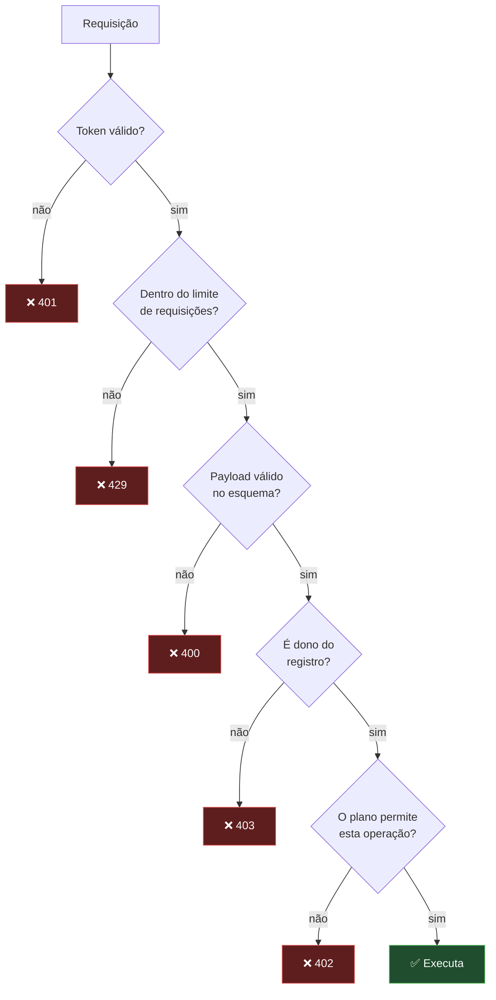

# Segurança

> ⚠️ **Documento conceitual.** Não contém segredos, chaves, algoritmos específicos de produção,
> parâmetros de configuração, endpoints reais nem detalhes que permitam explorar o sistema.
>
> O objetivo é demonstrar o **modelo de segurança** e as práticas adotadas.

---

## Princípios

| Princípio | Aplicação prática |
|---|---|
| **Defesa em profundidade** | Nenhum controle isolado é o único obstáculo |
| **Menor privilégio** | Cada componente acessa só o que precisa |
| **Nunca confiar no cliente** | Toda decisão de acesso é tomada e verificada no servidor |
| **Falhar fechado** | Na dúvida, negar; ambiguidade nunca concede acesso |
| **Rejeitar cedo** | Validação na borda, antes de gastar computação |
| **Segredos fora do código** | Nenhuma credencial versionada, em nenhuma circunstância |
| **Privacidade por padrão** | Consentimento explícito e coleta mínima |

---

## Autenticação

### JWT

Autenticação por **JSON Web Tokens** assinados, verificados criptograficamente na borda.

| Propriedade | Decisão |
|---|---|
| **Vida útil** | Curta — reduz a janela de exposição de um token comprometido |
| **Renovação** | Transparente; o usuário não é deslogado por expiração |
| **Verificação** | Stateless, sem consulta ao banco — preserva a latência da edge |
| **Transporte** | Exclusivamente sobre HTTPS |
| **Escopo** | O token carrega identidade, não permissões — estas são resolvidas no servidor |

O último ponto é deliberado. Um token que carrega permissões congela o estado de autorização no
momento da emissão: revogar acesso exigiria esperar o token expirar. Resolvendo a autorização a cada
requisição, uma mudança de plano ou um bloqueio de conta tem efeito imediato.

### Senhas

Armazenadas exclusivamente como **hash com função de custo adaptativo**, projetada para ser lenta
contra ataques de força bruta. Nunca há armazenamento reversível, e a senha original nunca é
registrada em log.

### OAuth 2.0

Login social com **Google** e **Apple**, usando os fluxos nativos de cada plataforma — SDK do
dispositivo, não webview.

Controles aplicados:

- **Validação do token do provedor no servidor.** O cliente informa que autenticou; o servidor
  confirma diretamente com o provedor. A palavra do cliente não basta.
- **Parâmetro `state` verificado** contra CSRF, com tempo de vida curto e uso único.
- **Redirecionamentos restritos** a uma lista fechada.
- **Tokens de terceiros criptografados em repouso**, nunca em texto claro.

### Segundo fator

Contas administrativas exigem **2FA**. O acesso a funções operacionais e a dados agregados nunca
depende apenas de senha.

---

## Autorização

Separada da autenticação. Saber *quem* é o usuário não responde *o que* ele pode fazer.

**Regras invioláveis:**

1. A propriedade do registro é verificada **no servidor**, a cada acesso
2. O direito de uso vem do estado de assinatura resolvido **no servidor**
3. Quotas de operações caras são verificadas **antes** da execução
4. Nenhuma permissão é inferida de informação enviada pelo cliente

---

## Transporte

- **HTTPS/TLS obrigatório** em toda a superfície pública
- **CORS restritivo** — apenas origens conhecidas são aceitas
- **Cabeçalhos de segurança** aplicados nas respostas
- Nenhum dado sensível trafega em parâmetros de URL, que acabam em logs e históricos

---

## Rate limiting

Limites aplicados por **identidade** e por **rota**, com tetos mais restritivos onde a operação é
cara — chamadas de IA, envio de mensagens, operações de escrita em lote.

Serve a três propósitos simultâneos: conter abuso, proteger o custo de operação e evitar que um único
usuário degrade a experiência dos demais.

Limites são acompanhados de um **teto de tamanho de payload**, aplicado na borda antes de o corpo da
requisição ser lido por completo.

---

## Criptografia

| Dado | Tratamento |
|---|---|
| **Senhas** | Hash com custo adaptativo, irreversível |
| **Tokens de terceiros** | Criptografados em repouso |
| **Dados em trânsito** | TLS em toda comunicação |
| **Material criptográfico** | Gerenciado pelo cofre de segredos da plataforma |
| **Arquivos do usuário** | Acesso sempre mediado e autorizado |

---

## Validação de entrada

Todo payload é validado contra **esquema** antes de chegar à lógica de domínio. A validação acontece
na borda, para que dados malformados nunca cheguem a consumir computação ou tocar o banco.

Proteções específicas:

| Vetor | Controle |
|---|---|
| **Injeção de SQL** | Consultas parametrizadas sempre; nenhuma concatenação de SQL |
| **XSS** | Escape por padrão no framework de interface |
| **CSRF** | Autenticação por token em cabeçalho, não por cookie de sessão |
| **Payload excessivo** | Teto de tamanho aplicado antes do processamento |
| **Injeção de prompt** | Fronteira mantida entre instrução do sistema e dado do usuário |
| **Poluição de parâmetros** | Esquema estrito; campos não previstos são rejeitados |

---

## Webhooks

Webhooks são entradas não autenticadas por usuário — precisam de tratamento próprio.

1. **Verificação de assinatura obrigatória.** Nenhum webhook é processado antes de a assinatura
   criptográfica do provedor ser confirmada. Um payload sem assinatura válida é descartado sem
   qualquer processamento.
2. **Processamento idempotente.** Provedores reentregam eventos. Cada evento carrega identificador
   único, e uma reentrega nunca produz efeito duplicado.
3. **Validação de origem.** A procedência do evento é conferida além da assinatura.
4. **Resposta rápida.** O webhook confirma o recebimento imediatamente; trabalho pesado é
   desacoplado, evitando reentregas por timeout.

Um exemplo **fictício** de payload de webhook está em
[`../examples/example-webhook.json`](../examples/example-webhook.json).

---

## Gestão de segredos

**Nenhum segredo é versionado — em nenhuma hipótese.**

- Chaves de API, credenciais de provedores e material criptográfico ficam no gerenciador de segredos
  da plataforma
- Acesso apenas em tempo de execução, pelo runtime
- O repositório contém apenas [`../templates/env.example`](../templates/env.example): nomes de
  variáveis, **sem valores**
- Arquivos de ambiente estão no `.gitignore` desde o primeiro commit
- Rotação de credenciais é possível sem alteração de código

---

## Privacidade e conformidade

Alinhado à **LGPD** e ao **GDPR**:

| Direito / obrigação | Implementação |
|---|---|
| **Consentimento explícito** | Opt-in dedicado e granular para processamento por IA |
| **Revogação** | Consentimento retirável a qualquer momento nas configurações |
| **Acesso e portabilidade** | Exportação dos dados do usuário pelo próprio aplicativo |
| **Eliminação** | Exclusão de conta com remoção dos dados associados |
| **Minimização** | Apenas o dado necessário é coletado e processado |
| **Transparência** | Política de privacidade e termos públicos; histórico de uso de IA visível |
| **Retenção limitada** | Rotina periódica de expurgo de dados expirados |

---

## Observabilidade e resposta

- **Logging estruturado sem dados pessoais.** O log registra o que aconteceu, não o conteúdo
  envolvido.
- **Alertas de segurança** em eventos relevantes: tentativas de acesso anômalas, falhas repetidas de
  autenticação, erros de integração.
- **Rastreamento de erros** com contexto suficiente para diagnóstico, sem expor dados do usuário.
- **Feature flags** permitem desativar rapidamente uma funcionalidade problemática sem novo deploy.

---

## Segurança na cadeia de build

- Dependências fixadas e atualizadas de forma deliberada
- Tipagem estrita e análise estática no pipeline
- Aplicativos assinados: notarização no macOS, assinatura no Windows, certificados das lojas no mobile
- Nenhum segredo embutido no bundle do cliente

---

## Divulgação responsável

Encontrou uma vulnerabilidade? Consulte [CONTRIBUTING.md](../CONTRIBUTING.md#segurança) antes de abrir
uma issue pública.

---

## Ver também

- [backend.md](backend.md) — autenticação e middleware
- [ai.md](ai.md) — privacidade na camada de IA
- [../SYSTEM_DESIGN.md](../SYSTEM_DESIGN.md) — decisões arquiteturais
