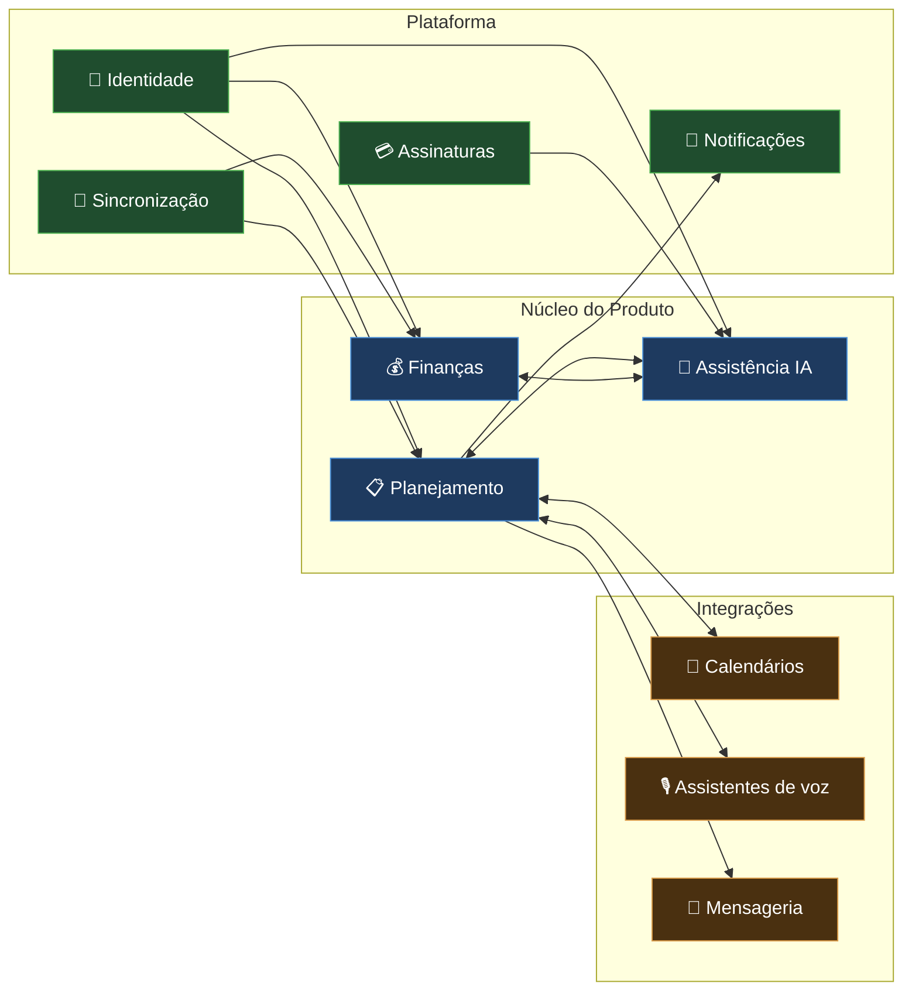
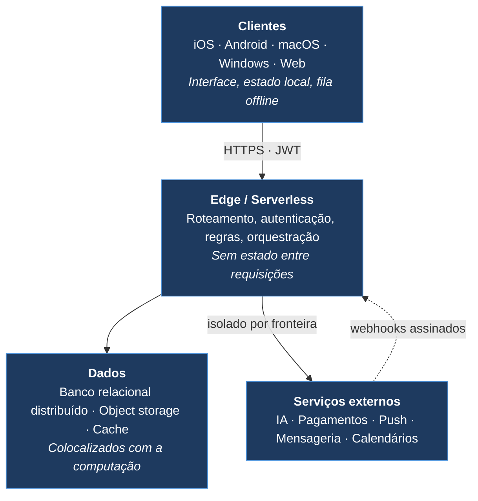

# Visão Geral do Sistema

> Documento conceitual. Não contém código, endpoints reais nem lógica de negócio proprietária.

---

## O que é o LodgeFlow

Uma plataforma de produtividade pessoal que une **planejamento de rotina**, **gestão financeira** e
**assistência por inteligência artificial**, distribuída de forma nativa em iOS, Android, macOS,
Windows e Web.

O produto parte de uma observação simples: a maior parte das ferramentas de produtividade ajuda a
registrar intenções, mas não ajuda a executá-las. O LodgeFlow se posiciona no espaço entre as duas
coisas — transforma uma descrição em linguagem natural em um plano concreto, entrega esse plano nos
canais que a pessoa já usa, e reorganiza o dia quando ele inevitavelmente sai do trilho.

---

## Domínios do sistema

O sistema é organizado em domínios com fronteiras claras. Cada um tem responsabilidade própria e se
comunica com os demais por interfaces explícitas.

### Planejamento

O domínio central. Cobre tarefas, subtarefas, projetos, recorrência, prioridades, comentários e
anexos, além das visões que os apresentam — planner semanal, calendário de dia, mês e ano.

É também o domínio que define o vocabulário do resto do sistema: quando a IA gera uma rotina, quando
um lembrete dispara ou quando um calendário externo sincroniza, todos falam em termos das entidades
definidas aqui.

### Finanças

Registro de entradas, saídas, categorias e pendências, com análise agregada — evolução mensal, resumo
anual, indicadores de saúde financeira e destaques automáticos do período.

Compartilha com o planejamento a noção de tempo e recorrência, mas mantém modelo e regras próprios.

### Assistência por IA

A camada que converte linguagem natural em estrutura. Atende três necessidades distintas:

- **Estruturação** — transformar uma descrição livre em uma rotina organizada
- **Reorganização** — recompor o dia quando o plano atrasa
- **Análise** — interpretar o panorama financeiro e sugerir ajustes

Inclui transcrição de voz, controle de consumo por usuário e um fluxo explícito de consentimento.

### Identidade

Autenticação, autorização e ciclo de vida da conta. Suporta credenciais próprias e login social
nativo, com segundo fator para contas administrativas, além de recuperação de senha, exportação de
dados e exclusão de conta.

### Sincronização

Mantém o estado convergente entre todos os dispositivos do usuário e entre o produto e os calendários
externos. É o domínio que carrega a complexidade de offline-first: fila durável de mutações,
resolução determinística de conflitos e sincronização incremental.

### Notificações

Escolhe o canal certo para cada lembrete conforme a criticidade e o estado do dispositivo: push
remoto, notificação local, chamada VoIP em tela cheia ou atividade ao vivo na tela de bloqueio.

### Assinaturas

Normaliza quatro provedores de pagamento em um único estado interno de acesso. Consome webhooks e
notificações de servidor, e responde uma pergunta só para o aplicativo: o que este usuário pode fazer
agora.

### Integrações

Calendários (Google, Apple), assistentes de voz (Siri, Alexa) e mensageria (WhatsApp). Cada uma
isolada atrás da própria fronteira, com credenciais, limites e tratamento de erro independentes.

---

## Camadas físicas

| Camada | Responsabilidade | O que **não** faz |
|---|---|---|
| **Clientes** | Interface, estado local, fila de mutações, recursos nativos | Não decide sobre permissões ou acesso |
| **Edge** | Autenticação, autorização, validação, orquestração, regras | Não mantém estado entre requisições |
| **Dados** | Persistência, consistência, arquivos | Não contém lógica de aplicação |
| **Externos** | Capacidades especializadas | Nunca são caminho crítico único |

---

## Fluxo típico de uma operação

1. O usuário age na interface
2. O aplicativo grava localmente e responde imediatamente (atualização otimista)
3. A mutação entra na fila durável de sincronização
4. Havendo rede, a requisição autenticada segue para a edge
5. A edge valida identidade, aplica limites de requisição e verifica a quota do plano
6. A operação é executada — persistência, chamada de IA ou integração externa, conforme o caso
7. O resultado retorna e o estado local é reconciliado
8. Sem rede, a mutação permanece na fila e é reenviada na reconexão

---

## Princípios transversais

| Princípio | O que significa na prática |
|---|---|
| **A rede é opcional** | Nenhuma escrita depende de conectividade para ser aceita |
| **O cliente nunca decide acesso** | Toda autorização é verificada no servidor, por registro |
| **Tudo é delimitado** | Nenhuma consulta de produto varre a base inteira |
| **Falha externa é esperada** | Cada integração tem timeout, retry e caminho de degradação |
| **Reentrega não duplica** | Operações sensíveis são idempotentes por construção |
| **Consentimento é explícito** | Nenhum dado vai para IA sem opt-in registrado |

---

## Próximos documentos

- [architecture.md](architecture.md) — arquitetura em camadas, detalhada
- [tech-stack.md](tech-stack.md) — stack completa por categoria
- [../SYSTEM_DESIGN.md](../SYSTEM_DESIGN.md) — decisões arquiteturais e trade-offs
